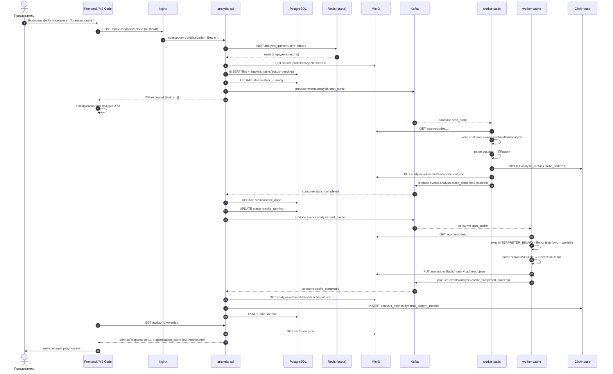

# Event-driven поток одной задачи

В этой странице — полный путь одного загруженного `.c` файла от UI до агрегированных метрик в ClickHouse.

## Полная sequence-диаграмма

## Что происходит на каждом шаге

### 1. Приём файла (analysis-api)

Use-case `UploadAndAnalyze` в `analysis-api-service/internal/usecase/analysis_usecase.go` делает строго упорядоченную последовательность:

1. `consumeQuota` — атомарный `INCR` ключа в Redis с TTL 24ч. Если превышено — `429 Too Many Requests`.
2. `minio.Upload` — загрузка `.c` в bucket `source-codes`.
3. `repo.CreateFile` + `repo.CreateTask` — записи в PostgreSQL.
4. `repo.UpdateTaskStatus(StatusStaticRun)` — переключение FSM.
5. `producer.Publish(TopicStartStatic, ...)` — событие в Kafka.

::: warning Порядок имеет значение
Файл сначала записывается в MinIO, и только потом задача переводится в `static_running` и публикуется событие. Если `minio.Upload` упал — задача остаётся `pending` и Kafka-сообщения нет, поэтому воркеры не получат «фантомное» задание.
:::

### 2. Static worker

[`worker-static-analyzer/cmd/main.go`](/workers/static-analyzer/) запускает один long-running consumer-loop. На каждое сообщение:

1. Скачивает `.c` в `os.MkdirTemp("", "static-analysis-*")`.
2. Пишет рядом `conf.json` и вызывает внешний бинарь `$ANALYZER_BINARY conf.json --quiet` (см. [Контракт бинаря](/workers/static-analyzer/binary-contract)). По умолчанию это `/usr/local/bin/analyzer` из публичного образа `keplar01/static-analyzer:latest`.
3. Читает `out.json` и десериализует его в `[]Pattern`.
4. Вставляет строки в `analysis_metrics.static_patterns` (ClickHouse).
5. Сохраняет тот же `out.json` в bucket `analysis-artifacts` под именем `static-out.json`.
6. Публикует `events.analysis.static_completed` со `status=success` или `error`.

### 3. Цепочка в analysis-api

`Consumer.handleStaticCompleted` ([`internal/kafka/consumer.go`](/backend/analysis-api/orchestration)) принимает результат и **сам переходит к следующему шагу пайплайна** — публикует `events.analysis.start_cache` после перевода задачи в `cache_running`.

::: info Почему API инициирует второй шаг, а не воркер
Так FSM остаётся под единственным контролем — `analysis-api`. Воркеры stateless: они никогда не перепишут чужой статус и не будут конкурировать за переход между фазами. Вся защита от гонок (см. [Lifecycle FSM](/architecture/task-lifecycle)) живёт в одном месте.
:::

### 4. Cache worker

[`worker-cache-interpreter/cmd/main.go`](/workers/cache-interpreter/):

1. Скачивает исходник в `os.MkdirTemp("", "cache-interp-*")`.
2. Запускает внешний симулятор: `<INTERPRETER_BINARY> basename(file.c) json` (см. [cache-interpreter](/workers/cache-interpreter/)).
3. Парсит текстовый и/или JSON-вывод в `CacheSimResult` — статистика L1/L2 + per-array и т.д.
4. Сохраняет JSON-артефакт `cache-out.json` в MinIO.
5. Публикует `events.analysis.cache_completed`.

::: tip Воркер сам не пишет в ClickHouse
Запись в `dynamic_pattern_metrics` делает `analysis-api-service` после получения `cache_completed`. Это нужно для того, чтобы JOIN-ить per-array промахи из `cache-out.json` со static-паттернами по `(source_file, base_symbol)`, а доступ к обоим источникам логичнее держать на стороне API-сервиса.
:::

### 5. Завершение

`Consumer.handleCacheCompleted` в API-сервисе скачивает `cache-out.json`, делает JOIN с `static_patterns` и пишет получившиеся строки в `analysis_metrics.dynamic_pattern_metrics`. После этого задача переводится в `done` (или `error`). Клиент, поллящий `/tasks/<id>`, увидит финальный статус; **`GET /tasks/<id>/metrics` читает тот же `cache-out.json` и не считает ClickHouse-агрегат** (см. [Метрики](/backend/analysis-api/metrics)).

## Точки отказа и их обработка

| Что упало | Что происходит | Как пользователь узнаёт |
|---|---|---|
| `minio.Upload` | use-case возвращает 500, Kafka не публикуется | API ответит 500 на `/upload` |
| Worker не смог распарсить файл | публикует `static_completed{status=error}` | API переводит задачу в `error` |
| Worker ушёл в panic между шагами | при перезапуске Kafka доставит сообщение снова (consumer group offset не закоммичен) | Возможен повтор записи в ClickHouse — допустимо, миграция MergeTree без unique-ключа |
| ClickHouse недоступен | воркер возвращает ошибку и публикует `error` | пользователь видит `status: error` в UI |
| Quota исчерпана | API сразу отдаёт 429, в Kafka ничего не уходит | UI показывает «Daily quota exceeded» |

::: warning Идемпотентность
Сейчас задачи **не строго идемпотентны** на уровне ClickHouse: повторное сообщение приведёт к дубликату строк. Это сознательный компромисс — таблицы `MergeTree` без `ReplacingMergeTree` намеренно простые, а API при агрегации использует `task_id` и `source_task_id`, поэтому **дубликат хуже всего влияет на `top_patterns` (счётчики чуть завышаются)**. См. также [ClickHouse schema](/contracts/clickhouse).
:::
