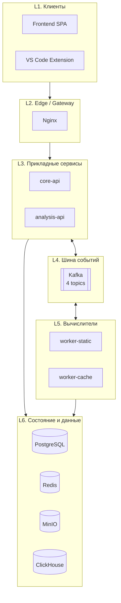

# Обзор архитектуры

Платформа состоит из **7 сервисов** и набора инфраструктурных компонентов. Главная идея архитектуры — **event-driven pipeline**: пользовательский запрос превращается в *задачу* (`task_id`), которая по шагам проходит через два независимых воркера, и каждый шаг — отдельное Kafka-сообщение.

## Сервисы и их роли

| Сервис | Технологии | Назначение |
|---|---|---|
| `core-api-service` | Go 1.22, Gin, PostgreSQL | Регистрация/логин, JWT, проекты, админ-операции |
| `analysis-api-service` | Go 1.24, Gin, PostgreSQL, Redis, MinIO, ClickHouse, Kafka | Оркестрация пайплайна анализа, агрегация метрик |
| `worker-static-analyzer` | Go 1.22, clang | Статический AST-анализ `.c`, извлечение паттернов памяти |
| `worker-cache-interpreter` | Go 1.22, gcc, valgrind | Запуск cachegrind, маппинг miss-ов на паттерны |
| `diploma-frontend` | Vue 3, Vite, Pinia, Tailwind, Monaco | Веб-UI пользователя и админа |
| `diploma-vscode` | TypeScript, web-tree-sitter | Расширение VS Code (in-editor анализ) |
| `diploma-infra` | Docker Compose, Nginx | Сборка системы воедино, gateway |

## Слои системы

## Зачем именно так

::: tip Почему event-driven, а не gRPC/HTTP
Воркеры выполняют долгие задачи (clang AST + valgrind легко занимают десятки секунд). Делать это синхронным запросом из API — значит держать HTTP-соединение открытым и блокировать пользователя. Kafka даёт:

- **Decoupling** — API ничего не знает про физическое расположение воркеров.
- **Backpressure** — если воркер не справляется, события буферизуются в топике (`StartStaticQueue` экспонируется в `/admin/system-status`).
- **Retry-friendly** — воркер может перезапуститься и догрести оставшиеся сообщения.
- **Линейный и понятный FSM** — каждое состояние задачи переключается в ответ на конкретное Kafka-событие.
:::

::: tip Почему два отдельных воркера
Static-анализ читает только `.c` исходник и строит AST через `clang`, а cache-анализ компилирует код и запускает `valgrind`. У них **совершенно разные runtime-зависимости** (`clang+musl-dev` vs `gcc+valgrind`) и разные SLA. Раздел на два контейнера позволяет:

- независимо масштабировать воркеры по нагрузке;
- держать base image минимальным (cache-воркер базируется на `debian:bookworm-slim`, потому что `valgrind` стабильно работает на glibc, а static — на `alpine`);
- перезапускать один воркер без влияния на другой.
:::

::: tip Почему два бэкенда
`core-api` и `analysis-api` решают разные задачи:

- **core-api** — синхронный CRUD пользователей и проектов. Stateless по запросу, нагружает только PostgreSQL.
- **analysis-api** — оркестратор пайплайна. Имеет фоновых консьюмеров Kafka, требует MinIO и ClickHouse.

Объединять их в монолит — добавлять долгоживущие соединения и события туда, где они не нужны (например, на `POST /auth/login`). Разделение даёт лёгкий core-api и тяжёлый analysis-api с разной частотой релизов.
:::

## Что читать дальше

- [Event-driven поток](/architecture/event-flow) — детальная схема одной задачи.
- [Состояние задачи (FSM)](/architecture/task-lifecycle) — переходы статусов, защита от гонок.
- [Глобальные принципы](/architecture/principles) — общие архитектурные решения и почему они выбраны.
