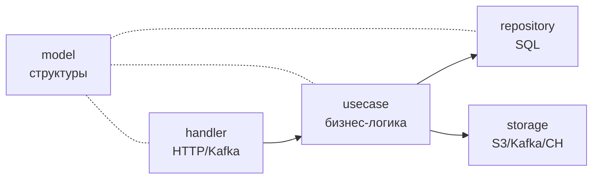

# Глобальные архитектурные принципы

Коллекция сквозных решений, повторяющихся во всех сервисах, и обоснование "почему именно так".

## 1. Clean Architecture в каждом Go-сервисе



Каждый Go-сервис строит каталоги по слоям:

- `cmd/api/main.go` — bootstrap (конфиг, dial, wiring зависимостей).
- `internal/handler` — HTTP/Kafka-боундари (Gin, segmentio/kafka-go).
- `internal/usecase` — оркестрация бизнес-операций.
- `internal/repository` — доступ к PostgreSQL через `sqlx`.
- `internal/storage` — клиенты MinIO/ClickHouse.
- `internal/model` — DTO и доменные структуры.

::: tip Почему именно такие слои
- **Тестируемость** — usecase можно покрыть unit-тестами, подменив `repo` на mock.
- **Замена транспорта** — HTTP можно поднять на gRPC без переписывания usecase.
- **Безопасные миграции** — у `repository` единственная зона ответственности (SQL), поэтому изменения в схеме не растекаются по handler-ам.
- **Понятная читаемость** — каждый PR ложится в один слой.
:::

## 2. Stateless процессы и идемпотентный запуск

Все Go-сервисы:

- Запускаются с любыми переменными окружения и **не требуют конфиг-файлов**.
- На старте делают `runMigrations(db)` — `CREATE TABLE IF NOT EXISTS` + `ALTER ... IF NOT EXISTS`. Запуск дважды подряд безопасен.
- Воркеры используют Kafka **consumer group** — параллельный запуск не дублирует обработку одного и того же сообщения.

::: warning Внутренние миграции "налету"
В `core-api` и `analysis-api` миграции написаны прямо в коде (см. `runMigrations` в `cmd/api/main.go`), а не через golang-migrate. Это компромисс ради простоты dev-окружения. В проде стоит вынести в отдельный CLI с явным versioning-ом.
:::

## 3. JWT через единый секрет

Оба бэкенда (`core-api`, `analysis-api`) разделяют один и тот же `JWT_SECRET`:

- core-api **выдаёт** токен в `auth.generateToken` (HS256, 24ч).
- analysis-api **только валидирует** через `middleware/JWTAuth` — никаких запросов к core-api.

::: tip Почему так, а не "auth-service"
В платформе из 2 бэкендов сетевой round-trip за валидацией токена даёт O(N) лишних запросов на каждое API-обращение. Разделяемый секрет + claims-based авторизация — это ровно то, для чего и придуман JWT. Когда количество сервисов вырастет — миграция на отдельный auth-service сводится к замене middleware.
:::

Claims, которые кладёт core-api и читает analysis-api:

```json
{
  "user_id": "uuid",
  "email": "user@example.com",
  "role": "user|admin",
  "analysis_quota": 10,
  "is_active": true,
  "exp": 1735689600,
  "iat": 1735603200
}
```

## 4. Storage stack: PostgreSQL + ClickHouse + MinIO + Redis

| Хранилище | Что хранит | Почему оно |
|---|---|---|
| **PostgreSQL** | users, projects, files, analysis_tasks | OLTP с ACID-транзакциями для оперативного состояния |
| **ClickHouse** | static_patterns, dynamic_pattern_metrics | OLAP-агрегации по сотням тысяч строк (`SUM`, `GROUP BY pattern_type`) — за миллисекунды |
| **MinIO** (S3) | source-codes, analysis-artifacts (json) | Большие бинарные/текстовые блобы, без нужды в SQL |
| **Redis** | analysis_quota:* | Атомарный `INCR` + TTL за 1 round-trip |

::: info Почему не "всё в PostgreSQL"
- Метрики на 100k+ строк с агрегациями `SUM(load_count + store_count)` — это "to be CH", а не "to be PG". MergeTree держит данные в colmunar формате и читает только нужные колонки.
- Хранение `.c` файлов и JSON-артефактов в БД быстро раздувает size и replication-нагрузку. S3-протокол лучше для blob-хранилища.
- Квоты со скользящим окном решаются Redis за O(1).
:::

## 5. Конфигурация через переменные окружения

Каждый сервис имеет `internal/config/config.go` с одной функцией `Load()`. Никаких yaml/toml — только env-переменные с дефолтами:

```go
func getEnv(key, fallback string) string {
    if v := os.Getenv(key); v != "" {
        return v
    }
    return fallback
}
```

::: tip Почему env, а не yaml
- 12-factor friendly: один и тот же артефакт деплоится в dev/prod, отличие — в env.
- Docker Compose / Kubernetes естественно умеют пробрасывать env.
- Дефолты в коде — это единственный источник правды о том, что нужно сервису.
:::

## 6. Healthchecks как контракт

Каждый сервис экспортирует `/health` с предсказуемым ответом:

```json
{ "status": "ok", "service": "core-api" }
```

Для критичной инфраструктуры (`analysis-api`) есть **расширенный health** — `GET /api/v1/analysis/admin/system-status`:

```json
{
  "postgres": { "status": "ok" },
  "minio": { "status": "ok" },
  "kafka": { "status": "ok" },
  "clickhouse": { "status": "ok" },
  "start_static_queue": 0
}
```

`start_static_queue` показывает количество необработанных сообщений в Kafka — встроенный indicator backpressure.

## 7. Frontend и VS Code: одинаковый API-клиент

Оба клиента используют один и тот же набор endpoint-ов через single base URL:

- Frontend: `axios.create({ baseURL: '/api/v1' })` с прокси на nginx.
- VS Code: `analyzer.apiUrl = http://localhost:80/api/v1` (настраивается).

::: tip Почему две версии UI вместо WebView внутри VS Code
- WebView — это "браузер в браузере", тяжелее по памяти и хуже интегрируется с лентой Diagnostic/CodeLens.
- Native VS Code API даёт нам бесплатный hover/codelens/severity и автоматическую интеграцию с Problems-панелью.
- При этом тот же бекенд обслуживает оба клиента, так что бизнес-логика не дублируется.
:::

## 8. Hot path локально, slow path удалённо

VS Code имеет **два режима** анализа:

- **Локальный (`web-tree-sitter`)** — мгновенный feedback (~50ms на средний файл) на каждое сохранение/правку.
- **Удалённый (полный пайплайн через analysis-api)** — даёт точные cachegrind-метрики, занимает секунды.

::: tip Почему именно tree-sitter, а не RegExp/clang
- RegExp не отличит `arr[i]` внутри `for` от такого же подвыражения в комментарии или в `if (false)` — без AST это статистически шумно.
- `clang` нельзя запустить в Extension Host (Node.js), а сетевой вызов на каждое нажатие клавиши — потеря UX.
- `web-tree-sitter` собирается в WASM (~600KB), парсит C-файл за десятки миллисекунд и работает прямо в Node-runtime VS Code.
:::
