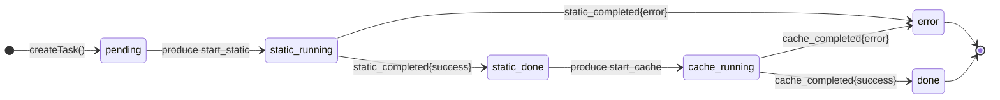

# Жизненный цикл задачи (Task FSM)

Задача (`analysis_tasks` в PostgreSQL) — это центральная сущность платформы. Её состояние двигает **только `analysis-api`**, чтобы исключить гонки между воркерами.

## Состояния и переходы



Соответствующие константы из [`analysis-api-service/internal/model/models.go`](/backend/analysis-api/data-model):

```go
const (
    StatusPending    = "pending"
    StatusStaticRun  = "static_running"
    StatusStaticDone = "static_done"
    StatusCacheRun   = "cache_running"
    StatusDone       = "done"
    StatusError      = "error"
)
```

## Где какой переход выполняется

| Переход | Кто переключает | В каком файле |
|---|---|---|
| `* → pending` | `usecase.UploadAndAnalyze` | `analysis_usecase.go` (создание `analysis_tasks`) |
| `pending → static_running` | `usecase.UploadAndAnalyze` | сразу после `CreateTask`, до `producer.Publish` |
| `static_running → static_done` | `Consumer.handleStaticCompleted` | `internal/kafka/consumer.go` |
| `static_done → cache_running` | `Consumer.handleStaticCompleted` | сразу после первого `UpdateTaskStatus` |
| `cache_running → done` | `Consumer.handleCacheCompleted` | `internal/kafka/consumer.go` |
| `* → error` | оба consumer-handler-а на `status:error` | `internal/kafka/consumer.go` |

## Защита от гонок

::: tip Почему статус двигает только API
Воркеры публикуют **факт** ("я закончил с success" / "я закончил с error"), а решение о следующем состоянии принимает только `analysis-api`. Это значит:

- два инстанса воркера никогда не пересекаются на одном и том же переходе (Kafka consumer group + единственный API-консьюмер на топик `*_completed`);
- любой переход — это `UPDATE analysis_tasks SET status = $1 WHERE id = $2` в PostgreSQL: атомарный SQL без явных блокировок;
- воркер не знает, что будет следующим шагом — это знание целиком у API.
:::

## Транзакционность Postgres + Kafka

::: warning Двухфазного коммита нет
Сообщение в Kafka и `UPDATE` в PostgreSQL выполняются в обычной последовательности — без 2PC. Это сознательный компромисс. Чтобы избежать "повисших" задач, мы:

1. **Пишем в Postgres до публикации в Kafka.** Если Kafka не доступен и сообщение не ушло — статус в БД отражает реальность (`static_running`), и любая попытка повторить пайплайн через ручную команду найдёт задачу в правильном состоянии.
2. **Делаем шаги воркера идемпотентными по эффекту.** Повторная вставка в ClickHouse — это лишь дубликат, агрегация по `task_id` всё равно покажет ожидаемый результат.
3. **Используем `RequiredAcks: RequireAll`** в Kafka producer — сообщение считается опубликованным только после ack от всех ISR-реплик (см. [Kafka producer](/backend/analysis-api/orchestration#kafka-producer-настройки)).
:::

## Тайминги и таймауты

| Шаг | Таймаут | Где задано |
|---|---|---|
| Static worker — обработка одного сообщения | 60 секунд | `processStaticAnalysis(ctx, …, 60*time.Second)` |
| Cache worker — обработка одного сообщения | 120 секунд | `processCacheSimulation(ctx, …, 120*time.Second)` |
| HTTP timeout фронта | 30 секунд | `axios.create({timeout: 30_000})` |
| Polling интервал FE | 2.5 секунды | `analyzer.pollingIntervalMs` (VS Code) / `useAnalysisPolling` (FE) |
| ClickHouse retry на старте | 30 попыток × 2с | `dialClickHouseWithRetry` в обоих воркерах |

::: info Почему cache-воркер получает 120 секунд
`valgrind --tool=cachegrind` интерпретирует машинный код инструкция-за-инструкцией — это *медленнее* в десятки раз, чем нативный запуск. Для маленьких диплом-программ 60 секунд хватает с запасом, но прыжок до 120 даёт буфер для тестов с большим объёмом данных или большим числом итераций (`tripCount` дефолтит на 1024).
:::

## Полная история одной задачи в БД

После успешного прогона записи выглядят так:

```sql
SELECT id, status, created_at, updated_at FROM analysis_tasks WHERE id = '550e84...';
-- id     | status | created_at        | updated_at
-- 550e.. | done   | 2026-05-04 00:01… | 2026-05-04 00:02…
```

Проследить путь по событиям можно через логи воркеров и `analysis-api`:

```text
[analysis-api] [kafka-producer] publishing to events.analysis.start_static
[worker-static] received: {"task_id":"550e84..."}
[worker-static] task 550e84... extracted 12 patterns
[worker-static] task 550e84... done
[analysis-api] [kafka-consumer] received from events.analysis.static_completed
[analysis-api] [kafka-producer] publishing to events.analysis.start_cache
[worker-cache] received: {"task_id":"550e84..."}
[worker-cache] task 550e84... done: D1=1234/56789 misses, 12 patterns
[analysis-api] [kafka-consumer] received from events.analysis.cache_completed
```
