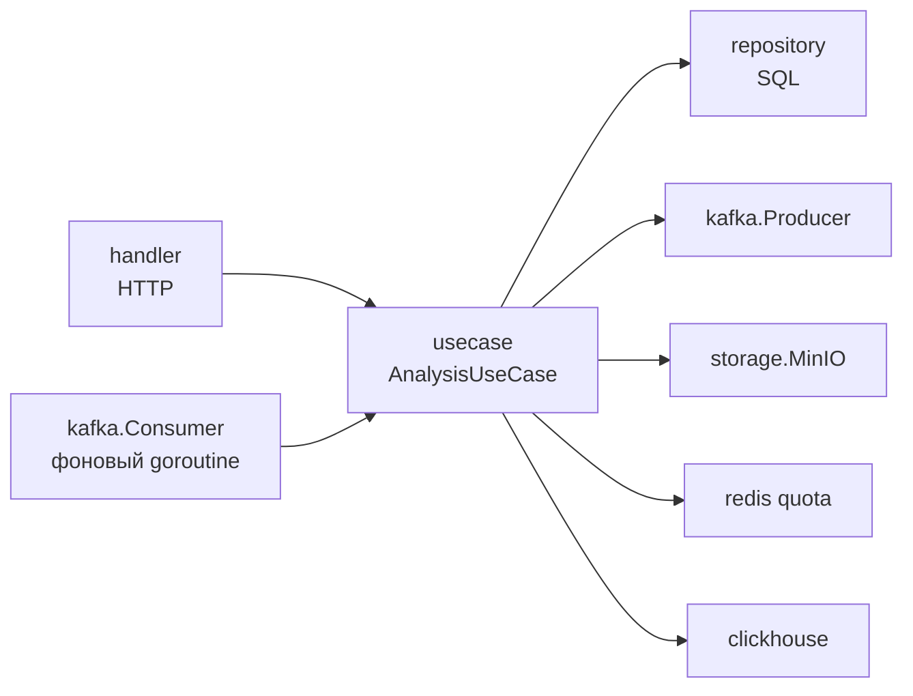
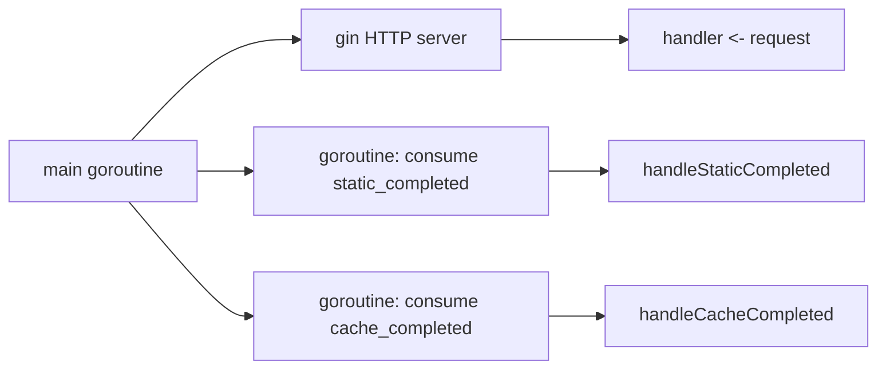
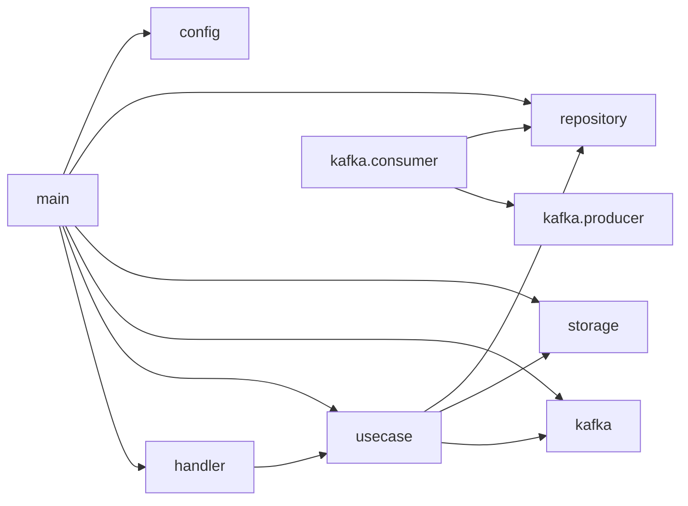

# Структура кода — Analysis API

## Layout

```
analysis-api-service/
├── cmd/
│   └── api/
│       └── main.go            # bootstrap, миграции, wiring всех зависимостей
├── internal/
│   ├── config/                # Load() из env
│   ├── handler/               # HTTP (Gin)
│   │   └── analysis_handler.go
│   ├── usecase/               # бизнес-логика, оркестрация
│   │   └── analysis_usecase.go
│   ├── repository/            # SQL via sqlx
│   │   └── analysis_repo.go
│   ├── kafka/                 # Producer + Consumer (segmentio/kafka-go)
│   │   ├── producer.go
│   │   └── consumer.go
│   ├── storage/
│   │   └── minio.go           # обёртка над minio-go
│   ├── middleware/
│   │   └── auth.go            # JWTAuth(Bearer + cookie), RequireAdmin — тот же JWT_SECRET и AUTH_COOKIE_NAME
│   └── model/
│       └── models.go          # File, AnalysisTask, Events, MetricsResponse, …
└── Dockerfile
```

## Слои с расширением



::: tip Kafka в качестве дополнительного "транспорта"
В Clean Architecture обычно есть только HTTP-handler. Здесь второй транспорт — `kafka.Consumer`, и он написан так же тонко, как handler: парсит события и зовёт repo. Но в этом сервисе **бизнес-логика переходов FSM** живёт прямо в `Consumer.handleStaticCompleted` / `handleCacheCompleted` — это компромисс, см. ниже.
:::

::: warning Где живёт FSM-логика
`Consumer.handleStaticCompleted` решает: переключить `static_running → static_done`, потом `static_done → cache_running`, потом продьюсить `start_cache`. Эта последовательность — бизнес-правило, и формально оно должно быть в usecase. Сейчас оно в consumer-е ради простоты.

Если переписать "по фен-шую" — выделить `usecase.AdvancePipeline(ctx, taskID, kind, status)` и звать из consumer-а.
:::

## Wiring в `main.go`

```go
db, _    := connectDB(cfg.DSN())
runMigrations(db)
minioClient, _ := storage.NewMinIOClient(...)
redisClient    := redis.NewClient(...)
chConn, _      := connectClickHouse(...)
producer       := kafka.NewProducer(cfg.KafkaBrokers)
defer producer.Close()

repo := repository.NewAnalysisRepository(db)

// Background consumer
consumer := kafka.NewConsumer(cfg.KafkaBrokers, repo, producer)
ctx, cancel := context.WithCancel(context.Background())
defer cancel()
consumer.StartListening(ctx)        // goroutines per topic

analysisUC      := usecase.NewAnalysisUseCase(repo, minioClient, producer, redisClient, chConn, cfg.KafkaBrokers)
analysisHandler := handler.NewAnalysisHandler(analysisUC)

// HTTP routes
r := gin.Default()
v1 := r.Group("/api/v1/analysis")
v1.Use(middleware.JWTAuth(cfg.JWTSecret))
v1.POST("/upload", analysisHandler.Upload)
v1.GET("/tasks/:task_id",         analysisHandler.GetTaskStatus)
v1.GET("/tasks/:task_id/metrics", analysisHandler.GetTaskMetrics)
v1.GET("/projects/:project_id/tasks", analysisHandler.GetProjectTasks)

admin := r.Group("/api/v1/analysis/admin")
admin.Use(middleware.JWTAuth(cfg.JWTSecret), middleware.RequireAdmin())
admin.GET("/stats", analysisHandler.GetAdminStats)
admin.GET("/patterns/top", analysisHandler.GetTopPatterns)
admin.GET("/system-status", analysisHandler.GetSystemStatus)
```

## Goroutine структура



::: info По одному consumer-горутине на каждый топик
`Consumer.StartListening` запускает 2 фоновые goroutine — для `static_completed` и `cache_completed`. Каждая использует свой `kafka.Reader` с собственным `GroupID`. Это:

- даёт независимые offset-ы для двух потоков;
- позволяет одному "застревать" на ошибке без блокировки другого.
:::

## Графы зависимостей



## Что в каком файле

| Файл | Что внутри |
|---|---|
| `cmd/api/main.go` | bootstrap, retry-loops, миграции, wiring |
| `internal/handler/analysis_handler.go` | 8 HTTP-эндпойнтов с базовой валидацией |
| `internal/usecase/analysis_usecase.go` | `UploadAndAnalyze`, `GetTaskMetrics`, `GetSystemStatus`, `GetTopPatterns`, квоты |
| `internal/repository/analysis_repo.go` | CRUD `files` и `analysis_tasks`, GetAdminStats |
| `internal/kafka/producer.go` | Writer на 4 топика, RequireAll |
| `internal/kafka/consumer.go` | 2 goroutine, FSM-переходы и публикация `start_cache` |
| `internal/storage/minio.go` | wrapper minio-go, bucket bootstrap |
| `internal/middleware/auth.go` | JWTAuth, RequireAdmin (idential к core-api по contract-у) |

## Дальше

- [Оркестрация задач](/backend/analysis-api/orchestration) — критический раздел: FSM, Kafka producer/consumer.
- [Метрики (ClickHouse)](/backend/analysis-api/metrics) — формула hit_rate/miss_rate.
- [Sequence: upload→done](/backend/analysis-api/flow).
