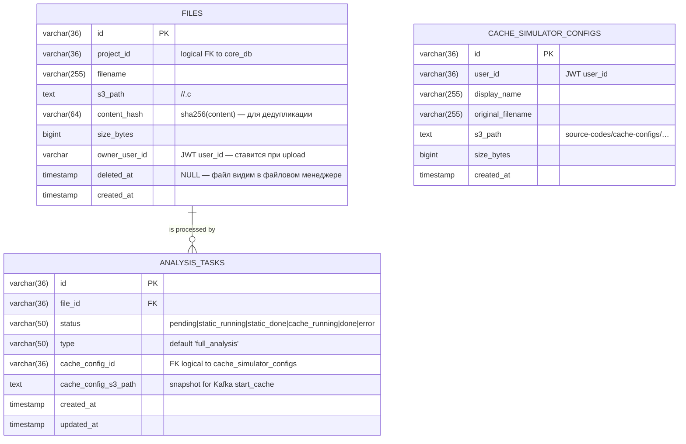
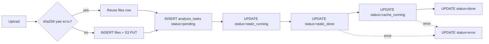

# Модель данных — Analysis API

В `analysis_db` живут таблицы `files`, `analysis_tasks` и **`cache_simulator_configs`**. Они покрывают OLTP-часть. OLAP-метрики — в [ClickHouse](/infrastructure/clickhouse).

## ER-диаграмма



## DDL

```sql
CREATE TABLE IF NOT EXISTS files (
    id           VARCHAR(36) PRIMARY KEY,
    project_id   VARCHAR(36) NOT NULL,
    filename     VARCHAR(255) NOT NULL,
    s3_path      TEXT NOT NULL,
    content_hash VARCHAR(64) NOT NULL DEFAULT '',
    size_bytes   BIGINT NOT NULL DEFAULT 0,
    owner_user_id VARCHAR(36) NOT NULL DEFAULT '',
    deleted_at TIMESTAMP NULL,
    created_at   TIMESTAMP NOT NULL DEFAULT NOW()
);

CREATE INDEX IF NOT EXISTS idx_files_project_id ON files(project_id);
CREATE INDEX IF NOT EXISTS idx_files_dedup
    ON files(project_id, filename, content_hash);

CREATE TABLE IF NOT EXISTS analysis_tasks (
    id         VARCHAR(36) PRIMARY KEY,
    file_id    VARCHAR(36) NOT NULL
                REFERENCES files(id) ON DELETE CASCADE,
    status     VARCHAR(50) NOT NULL DEFAULT 'pending',
    type       VARCHAR(50) NOT NULL DEFAULT 'full_analysis',
    created_at TIMESTAMP NOT NULL DEFAULT NOW(),
    updated_at TIMESTAMP NOT NULL DEFAULT NOW()
);

CREATE INDEX IF NOT EXISTS idx_tasks_file_id ON analysis_tasks(file_id);
CREATE INDEX IF NOT EXISTS idx_tasks_status ON analysis_tasks(status);

-- см. также runMigrations в analysis-api/cmd/api/main.go — актуальный DDL:
-- таблица cache_simulator_configs, столбцы analysis_tasks.cache_config_id / cache_config_s3_path, ...
```

::: info Полный DDL
Источник правды для старта контейнеров analysis-api — `runMigrations` в **`analysis-api/cmd/api/main.go`** (ALTER-ы добавляют конфиг симулятора, артефакты, ошибки задачи и т.д.).
:::

::: info Индекс по `status`
Запрос `GET /admin/system-status` агрегирует `count(*) FILTER (WHERE status = 'done')` и т.д. Без индекса по `status` Postgres делает full scan; с индексом — bitmap scan на меньшем диапазоне.
:::

## Доменные модели

```go
// internal/model/models.go
type File struct {
    ID          string    `db:"id" json:"id"`
    ProjectID   string    `db:"project_id" json:"project_id"`
    Filename    string    `db:"filename" json:"filename"`
    S3Path      string    `db:"s3_path" json:"s3_path"`
    ContentHash string    `db:"content_hash" json:"content_hash"`
    SizeBytes   int64     `db:"size_bytes" json:"size_bytes"`
    CreatedAt   time.Time `db:"created_at" json:"created_at"`
}

type AnalysisTask struct {
    ID                 string    `db:"id" json:"id"`
    FileID             string    `db:"file_id" json:"file_id"`
    Status             string    `db:"status" json:"status"`
    Type               string    `db:"type" json:"type"`
    CacheConfigID      string    `db:"cache_config_id" json:"cache_config_id"`
    CacheConfigS3Path  string    `db:"cache_config_s3_path" json:"cache_config_s3_path"`
    CreatedAt          time.Time `db:"created_at" json:"created_at"`
    UpdatedAt          time.Time `db:"updated_at" json:"updated_at"`
}

const (
    StatusPending    = "pending"
    StatusStaticRun  = "static_running"
    StatusStaticDone = "static_done"
    StatusCacheRun   = "cache_running"
    StatusDone       = "done"
    StatusError      = "error"
)
```

## Полный путь записи



::: tip Почему отдельные таблицы files и analysis_tasks
- **Один файл может быть проанализирован несколько раз** — каждая повторная попытка это новая `analysis_task`, но та же `files`-запись.
- **Чистый разделение** "артефакт" vs "процесс": файл — материальная сущность в MinIO, задача — состояние пайплайна.
:::

::: info Дедупликация
`UploadAndAnalyze` сначала ищет существующий `files`-row по
`(project_id, filename, sha256(content))`. Если нашёл — повторных записей в
Postgres и MinIO не делает. Тот же эффект для UI: повторный «Анализировать»
в Sandbox идёт по `POST /files/:file_id/analyze` и не порождает дубликаты.
:::

## Аналитические запросы

### Список задач проекта (с join)

```sql
SELECT at.id, at.file_id, at.status, at.type, at.created_at, at.updated_at
FROM analysis_tasks at
JOIN files f ON f.id = at.file_id
WHERE f.project_id = $1
ORDER BY at.created_at DESC;
```

Используется `GET /api/v1/analysis/projects/:id/tasks`.

### Admin stats

```sql
SELECT COUNT(*) FROM files;

SELECT
  COUNT(*) FILTER (WHERE status = 'done')    AS done,
  COUNT(*) FILTER (WHERE status = 'pending') AS pending,
  COUNT(*) FILTER (WHERE status = 'error')   AS error
FROM analysis_tasks;
```

::: warning "pending" в admin-stats
Здесь `pending` означает любой не-финальный статус (это сужение для отображения). Если хочется точнее — фильтр `WHERE status NOT IN ('done', 'error')`.
:::
