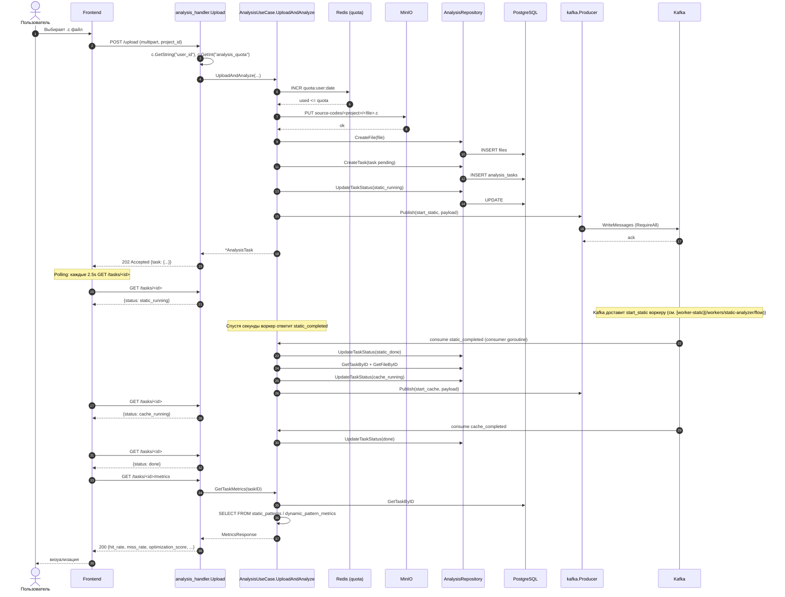

# Sequence: upload → done

Полный sequence от пользовательского клика "Анализировать" до зелёного `optimization_score` в UI. Эта диаграмма дополняет общую — [Event-driven поток](/architecture/event-flow), — фокусируясь именно на API.

## Sequence

## Polling, а не WebSocket

::: info Почему polling
- Простой реализационный путь — клиент сам контролирует интервал.
- Нет хранения долгоживущих соединений на сервере (важно для VS Code, где extension host не любит WebSocket-серверы).
- Нагрузка минимальна: одна задача даёт ~10–30 опросов до готовности (по 2.5с).

Если в будущем число одновременных задач вырастет — стоит перевести на SSE или WebSocket с push-уведомлением `task_id changed`.
:::

## Тайминги (типичный сценарий)

| Шаг | Время |
|---|---|
| Upload + INSERT + Publish | ~30–80 ms |
| Static analysis (clang AST + walker + CH insert) | ~500 ms – 5 с |
| Cache analysis (gcc + valgrind + parse + CH insert) | ~3 – 60 с |
| GetTaskMetrics (две агрегации в CH) | ~10 ms |

Cache worker обычно — bottleneck. Это нормально: cachegrind инструментирует код инструкция за инструкцией.

## Что произойдёт при ошибке на каждом шаге

| Шаг | Что упало | Эффект |
|---|---|---|
| INCR redis | redis недоступен | `500 quota check failed` |
| MinIO PUT | MinIO down | `500 minio upload` |
| INSERT files / tasks | Postgres down | `500 ...` |
| UPDATE static_running | Postgres down | task в `pending` навсегда (требует ручного rerun) |
| Producer.Publish | Kafka down | task в `static_running`, события нет |
| Consumer goroutine упала с panic | — | (сейчас просто log, без recover-а в loop) |
| Worker static error | static_completed с status=error | API переводит task в `error` |
| Worker cache error | cache_completed с status=error | task → `error` |

::: warning Идемпотентный rerun
Сейчас нет endpoint-а "перезапустить упавшую задачу". Можно сделать вручную:

1. `UPDATE analysis_tasks SET status='static_running' WHERE id=$1`
2. Дернуть `analysis-api` на `Producer.Publish(TopicStartStatic, payload)`. Сейчас публичного эндпойнта нет — только internal CLI.
:::
