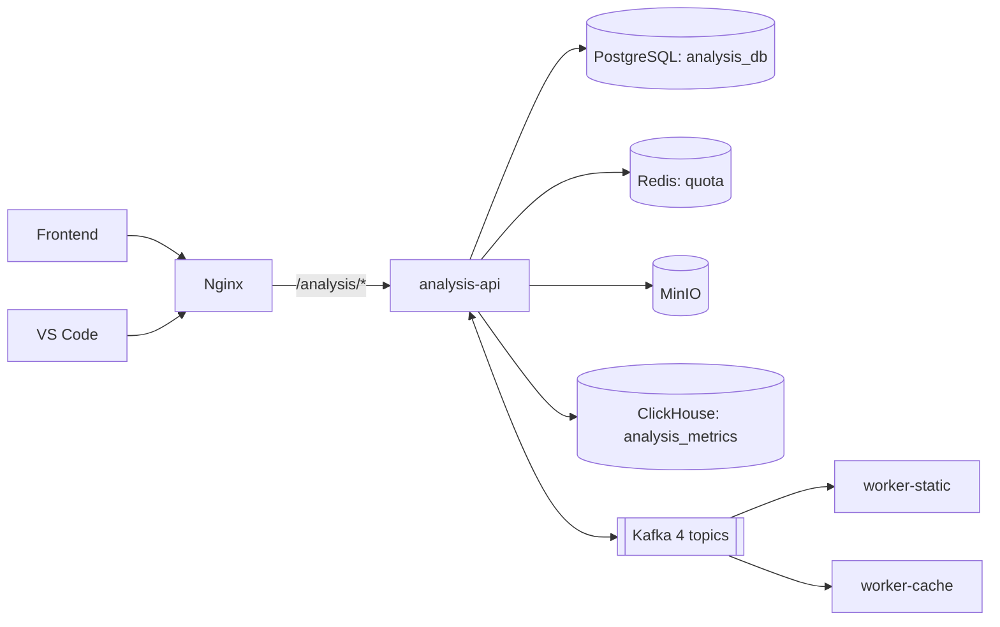

# Analysis API — Overview

`analysis-api-service` — сердце пайплайна анализа. Принимает `.c` файл, оркестрирует двух воркеров через Kafka и отдаёт пользователю агрегированные метрики.

## Место в системе

## Обязанности

::: tip Зачем сервис
- **Принять файл** и атомарно создать сущности `files` + `analysis_tasks`.
- **Защитить квотой** — INCR в Redis на user-day.
- **Запустить пайплайн** — продьюсить `events.analysis.start_static`.
- **Двигать FSM** — потреблять `events.analysis.*_completed` и переключать статус в БД.
- **Агрегировать метрики** — комбинировать `static_patterns` и `dynamic_pattern_metrics` в ClickHouse в один JSON для UI.
- **Мониторить шину** — экспонировать `start_static_queue` в админ-API.
:::

## Главные эндпойнты

| Метод | Путь | Доступ | Назначение |
|---|---|---|---|
| `POST` | `/api/v1/analysis/upload` | user+ | Загрузка `.c`, старт пайплайна |
| `GET`  | `/api/v1/analysis/tasks/:id` | user+ | Статус задачи |
| `GET`  | `/api/v1/analysis/tasks/:id/metrics` | user+ | Агрегированные метрики |
| `GET`  | `/api/v1/analysis/projects/:id/tasks` | user+ | Список задач проекта |
| `GET`  | `/api/v1/analysis/admin/stats` | admin | Сводка |
| `GET`  | `/api/v1/analysis/admin/patterns/top?limit=10` | admin | Топ паттернов |
| `GET`  | `/api/v1/analysis/admin/system-status` | admin | Health системных компонент |
| `GET`  | `/health` | public | Healthcheck |

Полные схемы — в [HTTP API → Analysis](/contracts/http#analysis-api).

## Что читать дальше

- [Стек и конфигурация](/backend/analysis-api/config) — env, retry, healthcheck.
- [Модель данных](/backend/analysis-api/data-model) — `files`, `analysis_tasks`, FSM.
- [Структура кода](/backend/analysis-api/architecture) — слои, wiring.
- [Оркестрация задач](/backend/analysis-api/orchestration) — критический раздел: как именно живёт задача и где защита от гонок.
- [Квоты (Redis)](/backend/analysis-api/quotas) — INCR + TTL.
- [Метрики (ClickHouse)](/backend/analysis-api/metrics) — как комбинируем static + dynamic.
- [Sequence: upload→done](/backend/analysis-api/flow) — sequence diagram полного пайплайна.
- [HTTP API](/backend/analysis-api/api) — детальные схемы.
