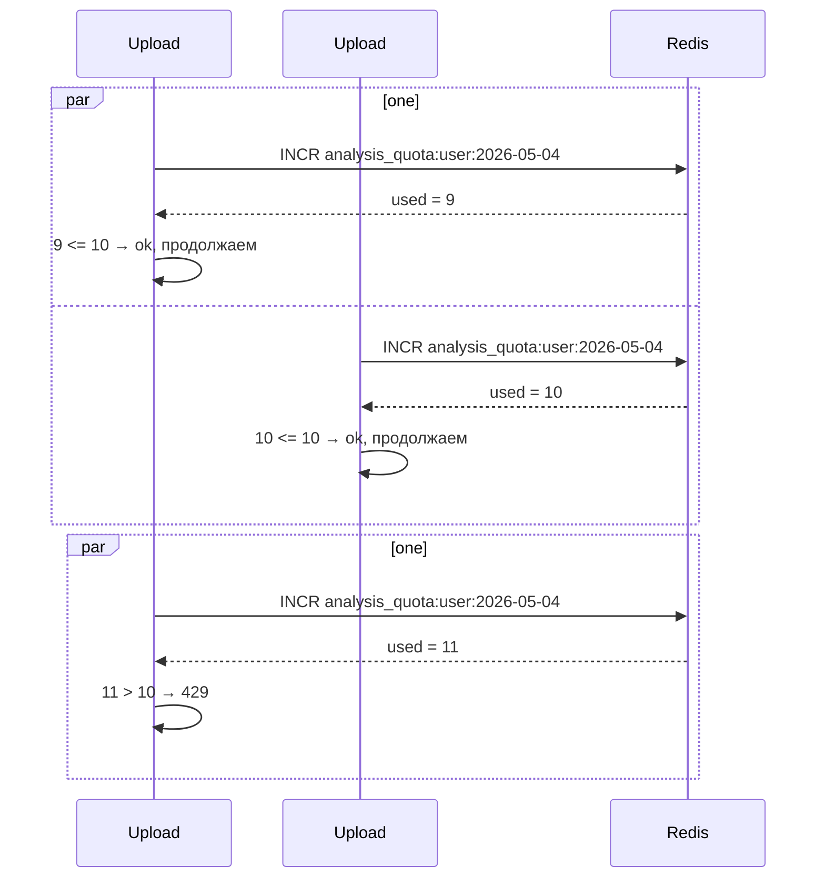
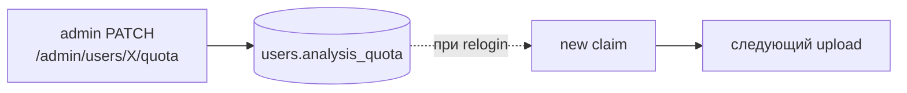

# Квоты (Redis)

Дневной лимит анализов на пользователя реализован как один `INCR` в Redis с TTL 24 часа.

## Реализация

```go
// internal/usecase/analysis_usecase.go
func (uc *AnalysisUseCase) consumeQuota(ctx context.Context,
                                        userID string, quota int) error {
    if quota <= 0 {
        return ErrQuotaExceeded
    }

    key := fmt.Sprintf("analysis_quota:%s:%s",
                        userID,
                        time.Now().UTC().Format("2006-01-02"))

    used, err := uc.redis.Incr(ctx, key).Result()
    if err != nil {
        return fmt.Errorf("quota check failed: %w", err)
    }
    if used == 1 {
        _ = uc.redis.Expire(ctx, key, 24*time.Hour).Err()
    }
    if used > int64(quota) {
        return ErrQuotaExceeded
    }
    return nil
}
```

## Что здесь важно

::: tip 4 решения
**1. Дата в ключе.** `analysis_quota:<uuid>:2026-05-04` — это естественное окно "на сегодня". Завтра ключ будет другой, проверять "сбросилась ли квота" не нужно.

**2. `INCR` атомарен.** Гарантирует, что `used` всегда инкрементируется ровно на 1, даже при тысяче параллельных upload-ов.

**3. `EXPIRE` только на первом INCR.** Если ставить TTL каждый раз, активный пользователь "продлевал" бы квоту бесконечно — день никогда бы не закрылся.

**4. Quota берётся из JWT.** Мы не лезем в Postgres за актуальной квотой — она уже в claim. Менее точно (изменение admin не применяется до relogin), но дёшево.
:::

## Гонка с lookups



::: warning Pay-before-do
`INCR` всегда инкрементируется, даже если потом мы возвращаем 429. То есть если пользователь промахнулся на 11-м запросе, у него на сегодня **израсходовано 11**, и любой следующий тоже получит 429. Это безопасно: лимит — верхняя граница в худшем случае.

Альтернатива — `INCR` → проверить → `DECR` обратно при превышении. Но это дополнительный round-trip и дополнительный риск гонки. Текущий вариант проще и достаточно строг.
:::

## Источник лимита

Квота попадает в claim JWT при логине:

```go
// core-api: auth_usecase.generateToken
"analysis_quota": user.AnalysisQuota,
```

Считывается analysis-api в middleware:

```go
// analysis-api: middleware/auth.go (idential к core-api)
analysisQuota := int(claims["analysis_quota"].(float64))
c.Set("analysis_quota", analysisQuota)
```

И достаётся handler-ом:

```go
quota := c.GetInt("analysis_quota")
task, err := h.analysisUC.UploadAndAnalyze(ctx, userID, quota, ...)
```

## Когда квота меняется



::: warning
Изменение квоты **не применяется к уже выданному токену**. Если пользователь в активной сессии и admin срезал лимит — пользователь будет "видеть" старую квоту до окончания токена (24ч max).

Это документированное ограничение. Альтернативы:

- короче TTL токенов + refresh,
- revoke list (Redis),
- читать квоту из БД на каждом upload (доп. round-trip).
:::

## Команды для отладки

```bash
docker exec -it diploma-fix-redis redis-cli -a redis_secret

# текущее использование пользователя за сегодня
GET analysis_quota:abc-uuid:2026-05-04

# до конца суток (в секундах)
TTL analysis_quota:abc-uuid:2026-05-04

# сброс (admin override)
DEL analysis_quota:abc-uuid:2026-05-04
```
