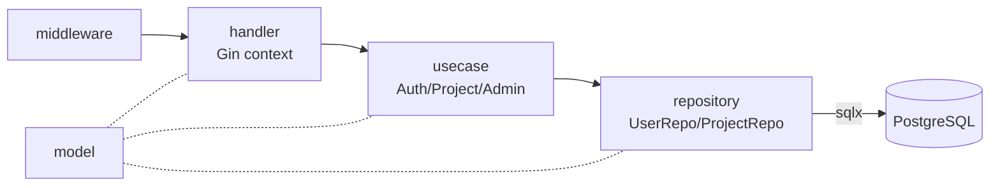
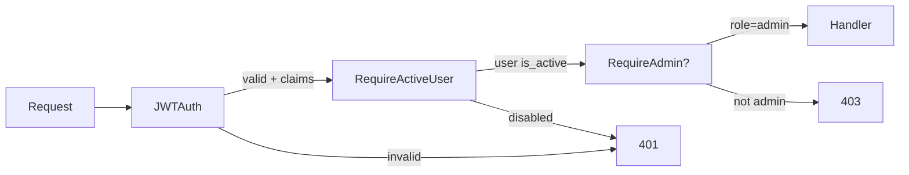

# Структура кода — Core API

## Layout

```
core-api-service/
├── cmd/
│   └── api/
│       └── main.go              # bootstrap, миграции, default admin, wiring
├── internal/
│   ├── config/
│   │   └── config.go            # Load() из env
│   ├── handler/                 # HTTP handlers (Gin)
│   │   ├── auth_handler.go
│   │   ├── project_handler.go
│   │   ├── admin_handler.go
│   │   ├── docs_gate.go          # ответ для nginx auth_request (опционально, если доки за gateway)
│   │   └── session_cookie.go    # HttpOnly cookie после login/register/impersonate
│   ├── usecase/                 # бизнес-логика
│   │   ├── auth_usecase.go
│   │   ├── project_usecase.go
│   │   └── admin_usecase.go
│   ├── repository/              # SQL via sqlx
│   │   ├── user_repo.go
│   │   └── project_repo.go
│   ├── middleware/
│   │   └── auth.go              # JWTAuth(Bearer + cookie), RequireAdmin, RequireActiveUser
│   └── model/                   # доменные структуры + DTO
│       ├── user.go
│       ├── project.go
│       └── admin.go
├── migrations/
│   └── 000002_add_user_roles.up.sql
├── go.mod / go.sum
└── Dockerfile
```

## Слои и потоки данных



## Wiring в `main.go`

```go
db, _ := connectDB(cfg.DSN())
runMigrations(db)

userRepo := repository.NewUserRepository(db)
projectRepo := repository.NewProjectRepository(db)

authUC    := usecase.NewAuthUseCase(userRepo, cfg.JWTSecret)
projectUC := usecase.NewProjectUseCase(projectRepo)
adminUC   := usecase.NewAdminUseCase(userRepo, projectRepo, authUC)

authHandler    := handler.NewAuthHandler(authUC, cfg)
projectHandler := handler.NewProjectHandler(projectUC)
adminHandler   := handler.NewAdminHandler(adminUC, cfg)

r := gin.Default()
v1 := r.Group("/api/v1")
{
    v1.GET("/internal/docs-gate", handler.DocsGate(cfg)) // опционально для nginx auth_request

    auth := v1.Group("/auth")           // public (+ logout cookie clear)
    projects := v1.Group("/projects")   // JWT (+ cookie) + active
    projects.Use(middleware.JWTAuth(cfg.JWTSecret, cfg.AuthCookieName),
                 middleware.RequireActiveUser(userRepo))
    admin := v1.Group("/admin")         // JWT + admin
    admin.Use(middleware.JWTAuth(cfg.JWTSecret, cfg.AuthCookieName),
              middleware.RequireActiveUser(userRepo),
              middleware.RequireAdmin())
}
```

## Почему именно Clean Architecture

::: tip
- **handler ничего не знает про SQL** — только маршалит HTTP-структуры в DTO usecase-а.
- **usecase ничего не знает про Gin** — может быть переиспользован, например, в gRPC-сервере.
- **repository — единственный, кто пишет SQL** — миграции и рефакторинг схемы остаются локальными.

Это компромисс: для маленького сервиса формальные слои выглядят излишеством, но при росте системы они окупаются — например, добавление gRPC API не потребует трогать usecase-ы.
:::

## Расписание middleware



`JWTAuth` извлекает claims из токена и кладёт их в Gin context (`c.Set("user_id", …)`). Это значит, что handler получает идентичность через `c.GetString("user_id")`, не парся токен заново.

## Глубже

- [JWT и middleware](/backend/core-api/auth) — формат токена, проверки, защита от disabled-аккаунтов.
- [Sequence: login](/backend/core-api/flow) — как запрос проходит все слои.
- [HTTP API](/backend/core-api/api) — детальные схемы.
