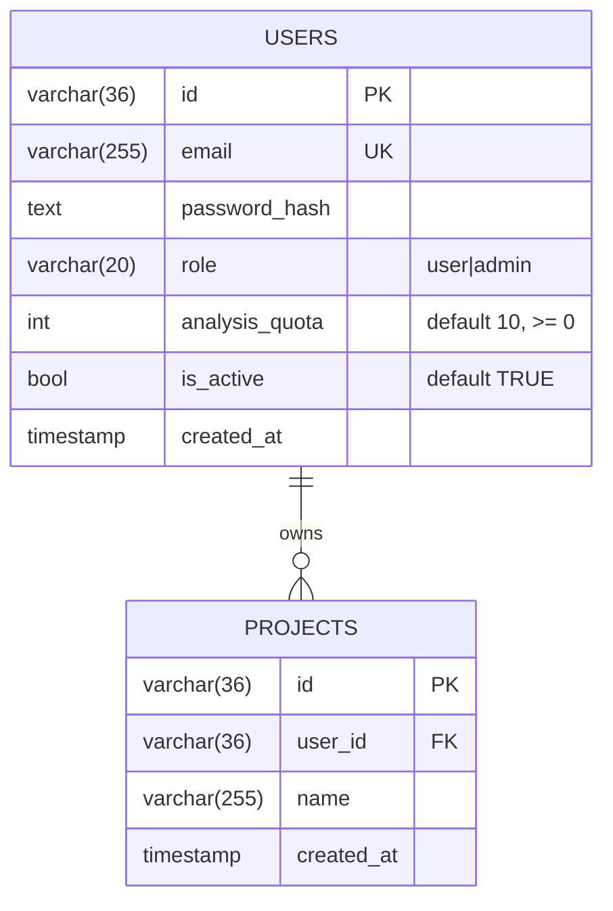

# Модель данных — Core API

## ER-диаграмма



## DDL

```sql
CREATE TABLE IF NOT EXISTS users (
    id            VARCHAR(36) PRIMARY KEY,
    email         VARCHAR(255) UNIQUE NOT NULL,
    password_hash TEXT NOT NULL,
    role          VARCHAR(20) NOT NULL DEFAULT 'user'
                  CHECK (role IN ('user', 'admin')),
    analysis_quota INTEGER NOT NULL DEFAULT 10
                  CHECK (analysis_quota >= 0),
    is_active     BOOLEAN NOT NULL DEFAULT TRUE,
    created_at    TIMESTAMP NOT NULL DEFAULT NOW()
);

CREATE TABLE IF NOT EXISTS projects (
    id         VARCHAR(36) PRIMARY KEY,
    user_id    VARCHAR(36) NOT NULL
               REFERENCES users(id) ON DELETE CASCADE,
    name       VARCHAR(255) NOT NULL,
    created_at TIMESTAMP NOT NULL DEFAULT NOW()
);

CREATE INDEX IF NOT EXISTS idx_projects_user_id ON projects(user_id);
```

## Доменные модели Go

```go
// internal/model/user.go
type User struct {
    ID            string    `json:"id" db:"id"`
    Email         string    `json:"email" db:"email"`
    PasswordHash  string    `json:"-" db:"password_hash"`
    Role          string    `json:"role" db:"role"`
    AnalysisQuota int       `json:"analysis_quota" db:"analysis_quota"`
    IsActive      bool      `json:"is_active" db:"is_active"`
    CreatedAt     time.Time `json:"created_at" db:"created_at"`
}

// internal/model/project.go
type Project struct {
    ID        string    `json:"id" db:"id"`
    UserID    string    `json:"user_id" db:"user_id"`
    Name      string    `json:"name" db:"name"`
    CreatedAt time.Time `json:"created_at" db:"created_at"`
}
```

::: info `json:"-"` на password_hash
Хеш никогда не уходит наружу в HTTP-ответе. Тэг `json:"-"` excludes поле при маршалинге — даже если разработчик случайно сделает `c.JSON(200, user)`, hash не утечёт.
:::

## Constraints и почему они нужны

| Constraint | Зачем |
|---|---|
| `email UNIQUE` | Один email — один аккаунт. `auth_usecase.Register` дополнительно проверяет это до bcrypt-а, но constraint — финальный rampart. |
| `role CHECK (...)` | Запрет на любые роли кроме `user`/`admin`. Защита от опечаток. |
| `analysis_quota CHECK (>= 0)` | Нельзя выставить отрицательную квоту через `PATCH /admin/.../quota`. |
| `is_active BOOLEAN` | Бан без удаления — данные пользователя сохраняются. |
| `ON DELETE CASCADE` на projects | Удаление пользователя автоматически чистит его проекты. Связь с `analysis_db.files` — на уровне приложения (см. ниже). |

## Cross-database связь

`projects` живут в `core_db`, а `files`/`analysis_tasks` — в `analysis_db` (см. [analysis-api → data-model](/backend/analysis-api/data-model)).

```
core_db                       analysis_db
─────────                     ──────────
users                         files
  └─ projects ─ "logical" ──> └─ project_id (просто строка, не FK)
                              └─ analysis_tasks
                                  └─ file_id (FK в analysis_db)
```

::: warning
- Удаление проекта в `core-api` **не каскадирует** на файлы в `analysis-api` — пока что это намеренно: артефакты могут быть полезны для аудита.
- При желании можно добавить background-job, который чистит "осиротевшие" файлы, но в текущей версии этого нет.
:::

## Default admin seed

В `cmd/api/main.go` функция `ensureDefaultAdmin` при первом запуске создаёт служебного admin-а:

```go
admin := &model.User{
    ID:            uuid.New().String(),
    Email:         "admin@system.local",
    PasswordHash:  string(bcrypt.GenerateFromPassword(...)),
    Role:          "admin",
    AnalysisQuota: 1000,
    IsActive:      true,
}
INSERT INTO users (...) VALUES (...)
ON CONFLICT (email) DO NOTHING
```

::: tip Идемпотентность
`ON CONFLICT (email) DO NOTHING` гарантирует, что повторный запуск не сломается, если admin уже существует.
:::
