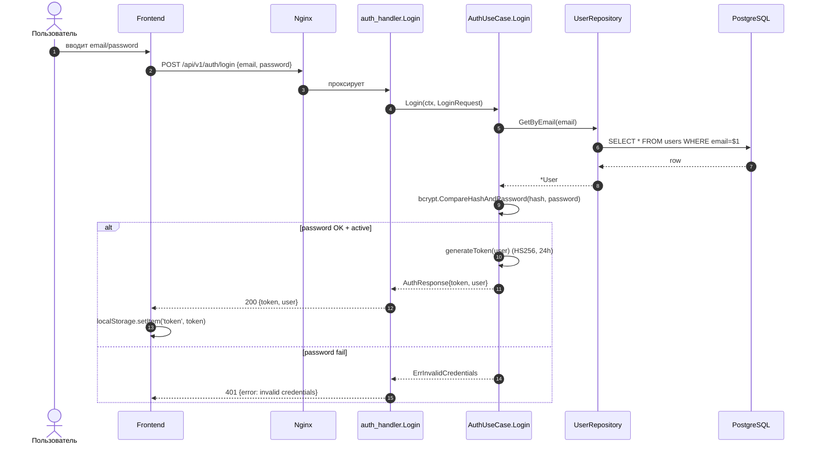
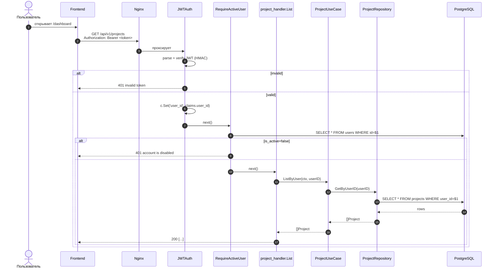
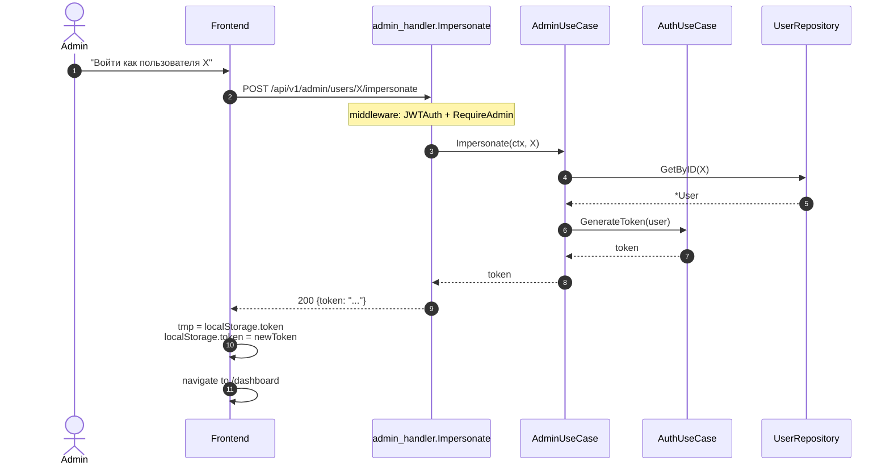

# Sequence: login и защищённый запрос

## Login → Token

## Защищённый запрос (например, GET /projects)

## Импepсонация (admin only)

::: tip
Импepсонация просто выдаёт **новый JWT** на чужого пользователя — никакого "режима имперсонации" с особым флагом. Это упрощает код: для бэкенда impersonated-сессия выглядит как обычная сессия пользователя X. Аудит ведётся через логи admin-действий (на уровне gin middleware).
:::

::: warning Безопасность
- Эндпойнт защищён `RequireAdmin`, поэтому только admin может его вызвать.
- В production нужно добавить аудит-лог "admin Y impersonated as user X at timestamp T".
- Длинный TTL токена (24ч) означает, что admin "становится" пользователем на сутки — рекомендую сократить до 1ч специально для имперсонации.
:::
