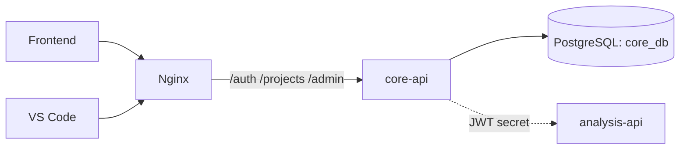

# Core API — Overview

`core-api-service` — backend для аутентификации и управления проектами. Он отвечает за:

- регистрацию и логин пользователей;
- выдачу JWT-токенов;
- CRUD проектов пользователя;
- админские операции (пользователи, квоты, статус, статистика).

## Место в системе

::: tip Почему отдельный сервис
- **Stateless** относительно анализа — ничего не знает про задачи, метрики, артефакты.
- Разделение ускоряет деплой: правки auth-логики не требуют пересборки тяжёлого `analysis-api` с MinIO/CH/Kafka.
- В будущем легко превратить в публичный SSO-провайдер.
:::

## Главные эндпойнты

| Метод | Путь | Доступ | Назначение |
|---|---|---|---|
| `POST` | `/api/v1/auth/register` | public | Регистрация |
| `POST` | `/api/v1/auth/login` | public | Логин, выдача токена |
| `GET`  | `/api/v1/projects` | user+ | Список своих проектов |
| `POST` | `/api/v1/projects` | user+ | Создать проект |
| `DELETE` | `/api/v1/projects/:id` | user+ | Удалить проект |
| `GET` | `/api/v1/admin/users` | admin | Все пользователи |
| `PATCH` | `/api/v1/admin/users/:id/quota` | admin | Менять квоту |
| `PATCH` | `/api/v1/admin/users/:id/active` | admin | Бан/разбан |
| `POST` | `/api/v1/admin/users/:id/impersonate` | admin | Войти за пользователя |
| `GET` | `/api/v1/admin/projects` | admin | Все проекты |
| `GET` | `/api/v1/admin/stats` | admin | Сводка |
| `GET` | `/health` | public | Healthcheck |

Полные схемы — в [HTTP API Reference](/contracts/http#core-api).

## Что читать дальше

- [Стек и конфигурация](/backend/core-api/config) — env, dependencies.
- [Модель данных](/backend/core-api/data-model) — ER-диаграмма.
- [Структура кода](/backend/core-api/architecture) — layout и почему именно так.
- [JWT и middleware](/backend/core-api/auth) — формат токена и proteccion цепочка.
- [Sequence: login](/backend/core-api/flow) — полный путь login → token → API call.
- [HTTP API](/backend/core-api/api) — детальные схемы.
