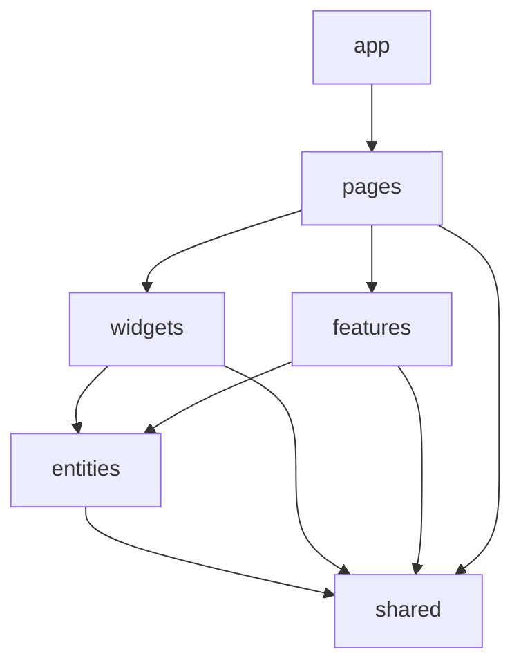
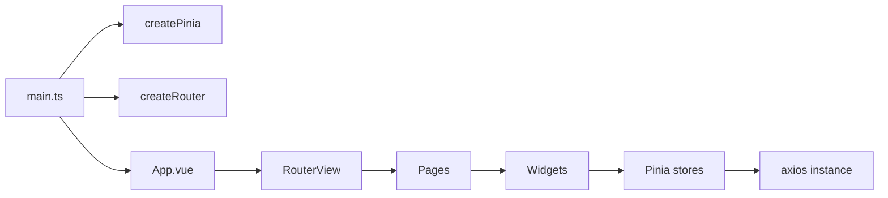

# Архитектура (близко к Feature-Sliced Design)

Структура проекта вдохновлена [Feature-Sliced Design (FSD)](https://feature-sliced.design/) — методикой деления frontend на слои с чёткими правилами импортов.

## Слои

```
src/
├── app/         # инициализация: router, базовые стили, App.vue
├── pages/       # страницы (route-targets)
├── widgets/     # большие переиспользуемые блоки UI
├── features/    # юзер-flow (auth, upload)
├── entities/    # доменные сущности (user, project, analysis, admin)
└── shared/      # API-клиент, утилиты, базовые UI-компоненты
```



::: tip Правило импортов FSD
Слой может импортировать **только то, что лежит ниже**:

- `app` импортирует всё.
- `pages` — `widgets`, `features`, `entities`, `shared`.
- `widgets` — `features`, `entities`, `shared`.
- `features` — `entities`, `shared`.
- `entities` — `shared`.
- `shared` — ничего внутри проекта.

Это даёт чистый граф зависимостей без циклов.
:::

## Что лежит в каждом слое

### `src/app/`

```
app/
├── App.vue        # корневой компонент с <RouterView/>
├── router/        # маршруты + guards (auth, admin-role)
└── styles/        # tailwind config + базовые стили
```

### `src/pages/`

```
pages/
├── LoginPage.vue
├── RegisterPage.vue
├── DashboardPage.vue
├── ProjectPage.vue
├── ForbiddenPage.vue
├── SandboxPage.vue
└── admin/
    ├── AdminUsersPage.vue
    ├── AdminProjectsPage.vue
    └── AdminSystemPage.vue
```

### `src/widgets/`

```
widgets/
├── AppHeader.vue                # header с user-info / logout
├── AnalysisPipelineStatus.vue   # визуализация FSM задачи
├── MetricsPanel.vue             # графики hit/miss/score
├── ProjectCard.vue              # карточка проекта в дашборде
├── CreateProjectModal.vue
└── sandbox/                     # внутренние sandbox-виджеты
```

### `src/features/`

```
features/
├── auth/        # login/register формы + submit-логика
└── upload/      # file picker + drag-and-drop, отправка multipart
```

### `src/entities/`

```
entities/
├── user/        { auth.store.ts, types.ts, index.ts }
├── project/     { project.store.ts, types.ts }
├── analysis/    { analysis.store.ts, types.ts }
└── admin/       { admin.store.ts, types.ts }
```

Каждая `entities/<domain>` экспортирует через `index.ts` свой store + types.

### `src/shared/`

```
shared/
├── api/          # axios instance + helper
├── lib/          # cn(), useAnalysisPolling
├── ui/           # AppButton, AppInput, AppToast
└── mock/         # моки для sandbox
```

## Почему именно FSD

::: tip
- **Доменная декомпозиция** идёт через `entities/*` — `user`, `project`, `analysis` — те же сущности, что и в бэкенде.
- **Переиспользование** через `widgets` — один и тот же `AnalysisPipelineStatus` применяется и в `ProjectPage`, и в админ-странице.
- **Изоляция фич** через `features/*` — auth-формы и upload-flow — это самостоятельные user-stories.
- **Single source of truth для shared** — axios instance, базовый UI-кит, API-моки.
:::

::: warning Не строгий FSD
Мы не используем `slices/segments` строго и не ставим линтер на правила импортов. Это сознательное упрощение: для проекта в 30+ компонентов FSD-lite достаточно, full-fat FSD добавит overhead.
:::

## Aliases

В `vite.config.ts`:

```ts
resolve: {
  alias: {
    '@': fileURLToPath(new URL('./src', import.meta.url)),
  },
}
```

Все импорты пишутся через `@/...`:

```ts
import { useAuthStore } from '@/entities/user'
import AppButton from '@/shared/ui/AppButton.vue'
```

## Главные точки входа

`src/main.ts`:

```ts
import { createApp } from 'vue'
import { createPinia } from 'pinia'
import App from './app/App.vue'
import router from './app/router'
import './app/styles/main.css'

createApp(App).use(createPinia()).use(router).mount('#app')
```


