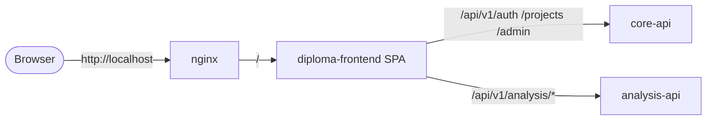

# Frontend (Vue 3) — Overview

`diploma-frontend` — основной веб-клиент платформы. Реализован на **Vue 3 + Vite** со state-управлением через Pinia, UI на Tailwind, и встроенным **Monaco Editor** для просмотра C-кода.

## Что умеет

- Регистрация и логин.
- Дашборд проектов.
- Загрузка `.c` файла → запуск анализа → визуализация прогресса.
- Метрики (hit/miss/score) с графиками (Chart.js).
- Админ-панель: пользователи, проекты, статус системы, top patterns.

## Место в системе

::: info Один origin
В docker-сборке frontend отдаётся через nginx (статика из `dist/`), а API-маршруты проксируются на бэкенды через `nginx.conf`. Это значит, что в production-сборке клиент **не делает CORS-preflight** — всё на одном origin.
:::

## Маршруты SPA

| Путь | Доступ | Страница |
|---|---|---|
| `/login` | public | LoginPage.vue |
| `/register` | public | RegisterPage.vue |
| `/dashboard` | user+ | DashboardPage.vue (список проектов) |
| `/projects/:id` | user+ | ProjectPage.vue (файлы, задачи, метрики) |
| `/admin/users` | admin | админ-страница |
| `/admin/projects` | admin | |
| `/admin/system` | admin | system-status + top-patterns |
| `/sandbox` | dev | внутренняя тестовая страница |
| `/forbidden` | — | редирект для не-admin |

## Дальше

- [Стек и конфигурация](/clients/frontend/config) — пакеты, env, build.
- [Архитектура (FSD)](/clients/frontend/architecture) — Feature-Sliced Design.
- [Стейт (Pinia)](/clients/frontend/state) — store-ы и потоки данных.
- [Polling & Monaco](/clients/frontend/integrations) — как поллим задачу и интегрировали редактор.
- [UI Screens](/clients/frontend/screens) — описание ключевых экранов.
