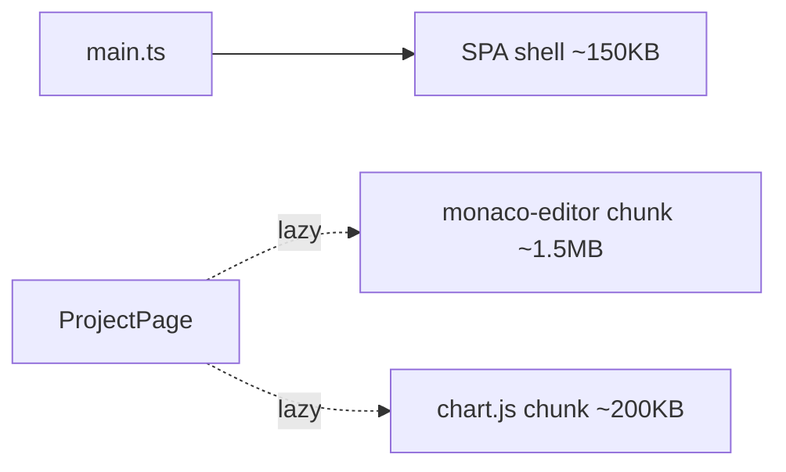

# Polling & Monaco Editor

## Polling задачи

Работа с долгими задачами реализована через polling — `composable useAnalysisPolling` (см. [Стейт](./state#composable-useanalysispolling)).

### Почему именно polling

::: tip
- **Простота** — одна функция в composable-е, никаких WebSocket-серверов.
- **VS Code реиспользует тот же подход** — это даёт единое решение для двух клиентов.
- Нагрузка на API минимальна: типичная задача — 10–30 опросов до завершения.
:::

### Параметры polling-а

- **Интервал**: 2.5 секунды (`intervalMs = 2500`).
- **Terminal statuses**: `done`, `error` — на этих останавливаемся.
- **Cleanup**: на `onUnmounted` принудительно `clearInterval`.

### Альтернативы (не выбраны)

- **WebSocket / SSE** — потребуется persistent-соединение и push с сервера. Стоит делать, когда число одновременных задач выходит за десятки.
- **Long polling** — лишний complexity для нашего сценария.

## Monaco Editor

Frontend использует [Monaco Editor](https://microsoft.github.io/monaco-editor/) (тот же редактор, что в VS Code) для просмотра C-кода с подсветкой и hover-подсказками.

### Интеграция

Через пакет `@guolao/vue-monaco-editor`:

```vue
<template>
  <VueMonacoEditor
    v-model:value="source"
    language="c"
    theme="vs-dark"
    :options="{ readOnly: true, minimap: { enabled: false } }"
  />
</template>

<script setup lang="ts">
import { VueMonacoEditor } from '@guolao/vue-monaco-editor'
const source = ref('// loaded from MinIO')
</script>
```

### Зачем Monaco, а не plain `<pre>`

::: tip
- **Подсветка C** работает из коробки — Monaco поставляется с TextMate-грамматиками для десятков языков.
- **Markers** — Monaco умеет отрисовывать предупреждения/ошибки на нужных строках (`monaco.editor.setModelMarkers(...)`). Это нам нужно для подсветки `non_unit_stride` или `gather_scatter` паттернов прямо на коде.
- **Доступность фич**: line numbers, выделение, копирование, мини-карта — всё бесплатно.
- **VS Code parity** — пользователь, открывая файл в браузере, видит ту же подсветку, что в редакторе.
:::

### Lazy-load для bundle size

Monaco — большая библиотека (>2MB). В сборке она режется на отдельный chunk, который грузится только на страницах с редактором. Pages без Monaco остаются лёгкими.



## Chart.js

Метрики hit/miss визуализированы через `vue-chartjs`:

```vue
<template>
  <Doughnut :data="chartData" :options="chartOptions" />
</template>
```

```ts
const chartData = computed(() => ({
  labels: ['Hits', 'Misses'],
  datasets: [{
    data: [metrics.cache_hits, metrics.cache_misses],
    backgroundColor: ['#22c55e', '#ef4444'],
  }],
}))
```

::: info Почему Chart.js, а не D3/Recharts/ECharts
- Простая API для базовых типов графиков (Doughnut, Bar, Line) — то, что нам нужно.
- Маленький bundle (~70KB gzipped).
- Vue-обёртка минимальна и не вмешивается в реактивность.
:::

## File upload (multipart)

Через нативный `<input type=file>` или drag-and-drop в `features/upload/`. Сборка `FormData`:

```ts
const form = new FormData()
form.append('project_id', projectId)
form.append('file', file)
await api.post('/analysis/upload', form, {
  headers: { 'Content-Type': 'multipart/form-data' },
})
```

::: tip Axios сам выставляет boundary
При passing `FormData` в axios.post — header `Content-Type: multipart/form-data; boundary=...` строится автоматически. Передача `'multipart/form-data'` в headers — не строго обязательно, но не мешает (axios не перезапишет автогенерированную часть с boundary).
:::

## Splitpanes

Для страниц с редактором + side-panel метрик используется библиотека `splitpanes`:

```vue
<template>
  <Splitpanes>
    <Pane :size="60">
      <CodeViewer :source="source" />
    </Pane>
    <Pane :size="40">
      <MetricsPanel :metrics="metrics" />
    </Pane>
  </Splitpanes>
</template>
```

Это даёт пользователю возможность ресайзить панели как в VS Code.
