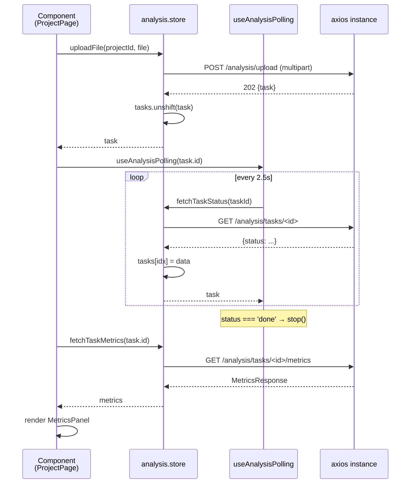

# Стейт (Pinia)

## Схема store-ов

```mermaid
flowchart LR
    Auth[useAuthStore<br/>token, user, login, logout] --> API[axios instance]
    Project[useProjectStore<br/>projects[], list, create, delete] --> API
    Analysis[useAnalysisStore<br/>tasks, files, uploads, cache configs] --> API
    Admin[useAdminStore<br/>users[], projects[], stats, system] --> API
    API -->|baseURL: /api/v1| Backend
```

## `useAuthStore`

Хранит токен и пользователя, обновляет localStorage и роутер.

```ts
// src/entities/user/model/auth.store.ts (упрощённо)
export const useAuthStore = defineStore('auth', () => {
  const token = ref<string | null>(localStorage.getItem('token'))
  const user  = ref<User | null>(parseUser(token.value))

  async function login(email: string, password: string) {
    const { data } = await api.post('/auth/login', { email, password })
    token.value = data.token
    user.value  = data.user
    localStorage.setItem('token', data.token)
  }

  function logout() {
    token.value = null
    user.value = null
    localStorage.removeItem('token')
    router.push('/login')
  }

  const isAdmin = computed(() => user.value?.role === 'admin')
  return { token, user, isAdmin, login, logout }
})
```

::: info Мини-spec store-ов
- **`useProjectStore`** — `projects` (`Project[]`), `fetchProjects`, `createProject(name)`, `deleteProject(id)`.
- **`useAnalysisStore`** — `tasks`, `files`, `loading`; `fetchProjectTasks`, **`fetchProjectFiles`**, **`deleteProjectFile`** (мягкое удаление строки через `DELETE /analysis/files/:id`), `uploadFile`/`analyzeExistingFile` с обязательным **`cache_config_id`**; методы конфигураций (`fetchCacheConfigs`, `uploadCacheConfig`, `deleteCacheConfig`, сохранённый последний конфиг через `persistPreferredCacheConfig`).
- **`useAdminStore`** — `users`, `projects`, `stats`, `systemStatus`, `topPatterns` + соответствующие fetch-методы.
:::

## `useAnalysisStore` подробно

```ts
// src/entities/analysis/model/analysis.store.ts
export const useAnalysisStore = defineStore('analysis', () => {
  const tasks = ref<AnalysisTask[]>([])
  const loading = ref(false)

  async function fetchProjectTasks(projectId: string) {
    loading.value = true
    try {
      const { data } = await api.get(`/analysis/projects/${projectId}/tasks`)
      tasks.value = data.tasks ?? []
    } finally { loading.value = false }
  }

  async function uploadFile(projectId: string, file: File, cacheConfigId: string): Promise<AnalysisTask> {
    const form = new FormData()
    form.append('project_id', projectId)
    form.append('file', file)
    form.append('cache_config_id', cacheConfigId.trim())
    const { data } = await api.post('/analysis/upload', form, {
      headers: { 'Content-Type': 'multipart/form-data' },
    })
    tasks.value.unshift(data.task)
    return data.task
  }

  async function fetchTaskStatus(taskId: string) {
    const { data } = await api.get(`/analysis/tasks/${taskId}`)
    const idx = tasks.value.findIndex((t) => t.id === taskId)
    if (idx !== -1) tasks.value[idx] = data
    return data
  }

  async function fetchTaskMetrics(taskId: string) {
    const { data } = await api.get(`/analysis/tasks/${taskId}/metrics`)
    return data
  }

  return {
    tasks,
    loading,
    fetchProjectTasks,
    fetchProjectFiles,
    deleteProjectFile,
    fetchCacheConfigs,
    uploadCacheConfig,
    deleteCacheConfig,
    uploadFile,
    analyzeExistingFile,
    fetchTaskStatus,
    fetchTaskMetrics /* + см. репо: aggregated, static patterns, simulation results */,
  }
})
```

::: tip Что здесь полезного
- Store держит массивы `tasks`, а при необходимости список **`files`** для песочницы; после polling `fetchTaskStatus` обновляет конкретную запись.
- `uploadFile` / `analyzeExistingFile` обязаны прикладывать **`cache_config_id`** (см. panel `CacheSimulatorConfigToolbar`); иначе Analysis API отклонит запрос.
- `uploadFile` пушит новый `task` наверх массива до завершения воркера — быстрый отклик UI.
- **`deleteProjectFile`** вызывает мягкое `DELETE /analysis/files/:id`; сайдбары обновляют `fetchProjectFiles`, чтобы скрытые записи исчезли.
:::

## Composable `useAnalysisPolling`

```ts
// src/shared/lib/useAnalysisPolling.ts
const TERMINAL_STATUSES: TaskStatus[] = ['done', 'error']

export function useAnalysisPolling(taskId: string, intervalMs = 2500) {
  const status = ref<TaskStatus>('pending')
  const polling = ref(true)
  const store = useAnalysisStore()
  let timer: ReturnType<typeof setInterval> | null = null

  async function poll() {
    try {
      const task = await store.fetchTaskStatus(taskId)
      status.value = task.status
      if (TERMINAL_STATUSES.includes(task.status)) stop()
    } catch { stop() }
  }

  function start() { polling.value = true; poll(); timer = setInterval(poll, intervalMs) }
  function stop()  { polling.value = false; if (timer) { clearInterval(timer); timer = null } }

  onUnmounted(stop)
  start()
  return { status, polling, stop }
}
```

::: tip Почему отдельный composable
Polling нужен и в `ProjectPage`, и в `AnalysisPipelineStatus` widget-е. Composable инкапсулирует:

- запуск/останов таймера;
- terminal-statuses (когда останавливать опросы);
- автоматический cleanup на `onUnmounted`.

Без него каждый компонент дублировал бы `setInterval/clearInterval` boilerplate.
:::

## Поток данных при анализе файла



## Persistence

Сейчас persist-ится **только token** в `localStorage`. Pinia stores не используются с `pinia-plugin-persistedstate` — после перезагрузки список проектов и задач подгружается заново через REST.

::: info Почему так
- Не нужно справляться с инвалидацией: после reload данные точно свежие.
- Сетевая часть быстрая (десятки ms), не оправдывает сложность управления stale state.
:::
