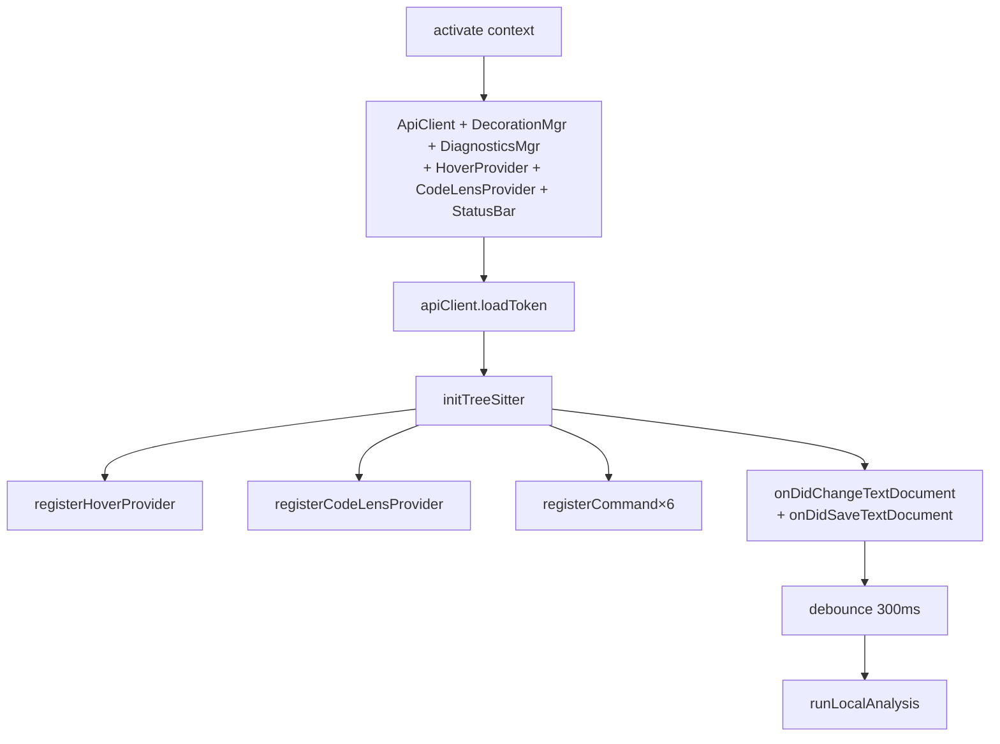
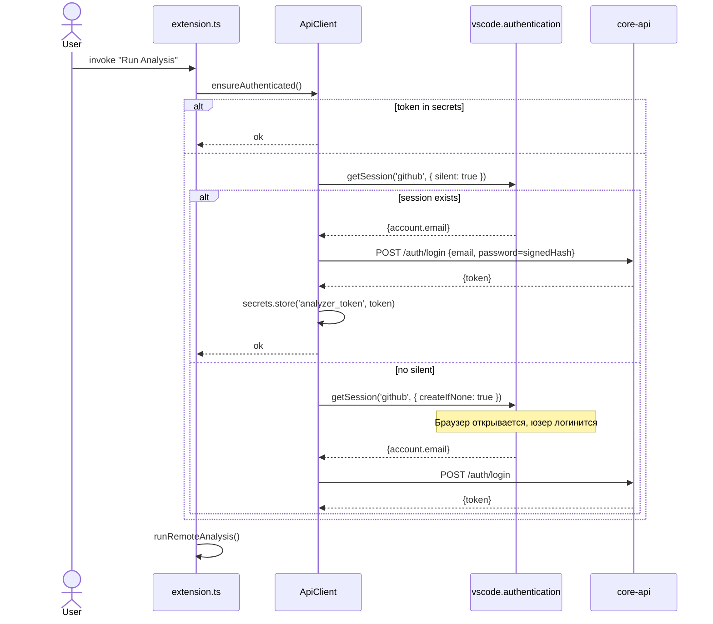
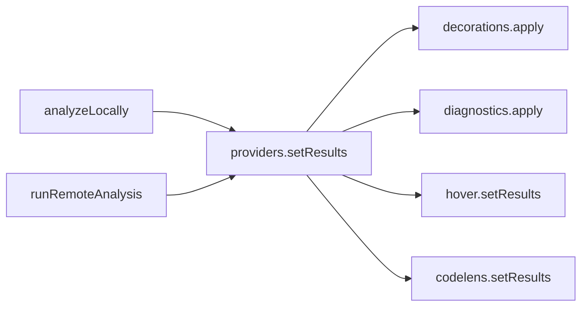

# Архитектура расширения

## Layout

```
diploma-vscode/
├── src/
│   ├── extension.ts            # точка входа: activate(), команды, glue
│   ├── api/
│   │   └── client.ts           # ApiClient: auth + REST к платформе
│   ├── local/
│   │   └── treeSitterAnalyzer.ts  # initTreeSitter, analyzeLocally
│   ├── providers/
│   │   ├── decorationManager.ts   # подсветка строк (TextEditorDecorationType)
│   │   ├── diagnosticsManager.ts  # ошибки/варнинги в Problems
│   │   ├── hoverProvider.ts       # hover-tooltips с описанием паттерна
│   │   └── codeLensProvider.ts    # CodeLens ссылки над функциями
│   ├── ui/
│   │   └── reportPanel.ts      # webview с метриками
│   └── types.ts                # AnalysisEntry, AnalysisMetrics, ...
├── tree-sitter-c.wasm          # компилированный парсер C
├── webpack.config.js
└── package.json
```

## Главный flow в `extension.ts`



## Регистрация команд

```ts
context.subscriptions.push(
  vscode.commands.registerCommand('analyzer.login',           () => doLogin()),
  vscode.commands.registerCommand('analyzer.logout',          () => doLogout()),
  vscode.commands.registerCommand('analyzer.runAnalysis',     () => runRemoteAnalysis()),
  vscode.commands.registerCommand('analyzer.localAnalysis',   () => runLocalAnalysis(activeEditor)),
  vscode.commands.registerCommand('analyzer.showReport',      () => ReportPanel.createOrShow(...)),
  vscode.commands.registerCommand('analyzer.clearDecorations',() => clearAll()),
)
```

## Auto-local-analysis

Когда `analyzer.autoLocalAnalysis === true` — расширение слушает изменения и сохранения документа:

```ts
vscode.workspace.onDidChangeTextDocument(({ document }) => {
  if (document.languageId !== 'c') return
  if (debounceTimer) clearTimeout(debounceTimer)
  debounceTimer = setTimeout(() => {
    const editor = vscode.window.activeTextEditor
    if (editor && editor.document === document) runLocalAnalysis(editor)
  }, 300)
})

vscode.workspace.onDidSaveTextDocument((document) => {
  if (document.languageId !== 'c') return
  const editor = vscode.window.activeTextEditor
  if (editor && editor.document === document) runLocalAnalysis(editor)
})
```

::: tip Debounce 300ms
Без debounce каждое нажатие клавиши вызывало бы parse, а это даже для tree-sitter — лишняя работа. 300ms — проверенный баланс между "ощущается живым" и "не дёргается на каждый символ".
:::

## ApiClient — auth flow



::: tip Почему через VS Code Account
- Пользователь в большинстве случаев **уже залогинен** в VS Code через GitHub/Microsoft — нам бесплатно даётся идентификация.
- При первом запуске `createIfNone: true` открывает браузер для подтверждения, что не страшно для интерактивного UX.
- Email из VS Code account → детерминированный пароль → backend выдаёт обычный JWT. Это "passwordless" с точки зрения юзера, но без отдельной OAuth-инфраструктуры.
:::

::: warning Trade-off
Этот flow требует, чтобы у пользователя был активный VS Code Account (GitHub/Microsoft). Если человек никогда не логинился в VS Code — ему придётся пройти GitHub-флоу. Альтернатива — добавить ручной login-prompt.
:::

## Status bar

```ts
statusBarItem = vscode.window.createStatusBarItem(vscode.StatusBarAlignment.Left, 50)
statusBarItem.command = 'analyzer.runAnalysis'
// показывает $(beaker) Analyzer | $(pass-filled) Analyzer: user@email
```

Кликабельный — запускает удалённый анализ.

## Provider lifecycle

`DecorationManager`, `DiagnosticsManager`, `HoverProvider`, `CodeLensProvider` — это **синглтоны** на extension host. Они держат "последний результат анализа" (`lastResults`) и применяют его к **активному editor**-у.



При смене активного editor-а DecorationManager заново применяет decorations к новому документу — чтобы переключение между файлами не "съедало" подсветку.

## Дальше

- [Tree-sitter](./tree-sitter) — главный технический раздел.
- [Providers (UX)](./providers) — детали по каждому provider-у.
