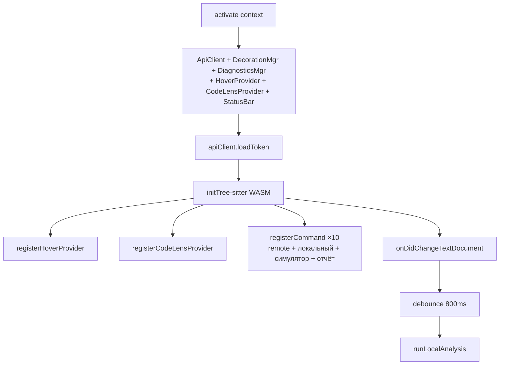
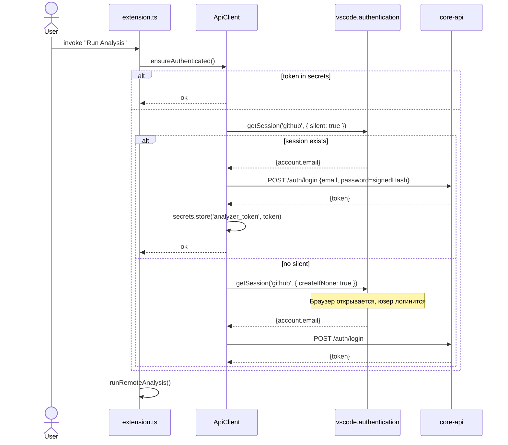
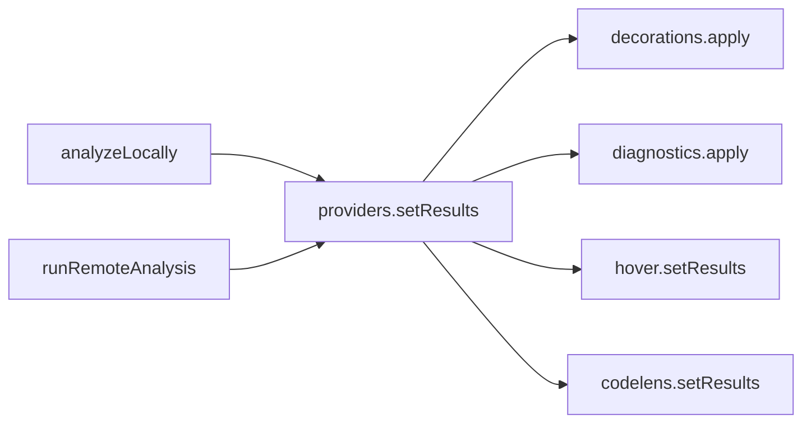

# Архитектура расширения

## Layout

```
diploma-vscode/
├── src/
│   ├── extension.ts            # точка входа: activate(), команды, glue
│   ├── api/
│   │   └── client.ts           # ApiClient: auth + REST к платформе
│   ├── local/
│   │   └── treeSitterAnalyzer.ts  # initTreeSitter, analyzeLocally
│   ├── providers/
│   │   ├── decorationManager.ts   # подсветка строк (TextEditorDecorationType)
│   │   ├── diagnosticsManager.ts  # ошибки/варнинги в Problems
│   │   ├── hoverProvider.ts       # hover-tooltips с описанием паттерна
│   │   └── codeLensProvider.ts    # CodeLens ссылки над функциями
│   ├── ui/
│   │   └── reportPanel.ts      # webview с метриками
│   └── types.ts                # AnalysisEntry, AnalysisMetrics, ...
├── tree-sitter-c.wasm          # компилированный парсер C
├── webpack.config.js
└── package.json
```

## Главный flow в `extension.ts`



## Регистрация команд

```ts
context.subscriptions.push(
  vscode.commands.registerCommand('analyzer.login', …),
  vscode.commands.registerCommand('analyzer.logout', …),
  vscode.commands.registerCommand('analyzer.runAnalysis', …),
  vscode.commands.registerCommand('analyzer.localAnalysis', …),
  vscode.commands.registerCommand('analyzer.showReport', …),
  vscode.commands.registerCommand('analyzer.clearDecorations', …),
  vscode.commands.registerCommand('analyzer.selectCacheSimulatorConfig', …),
  vscode.commands.registerCommand('analyzer.addCacheSimulatorConfig', …),
  vscode.commands.registerCommand('analyzer.newSampleCacheSimulatorConfig', …),
  vscode.commands.registerCommand('analyzer.forgetCacheSimulatorConfig', …),
)
```

## ApiClient и конфиг симулятора

В `ApiClient` хранятся:

| Ключ хранилища | Где |
|---|---|
| JWT | `secrets` → `analyzer_token` |
| `analyzer_project_id` | `globalState` (проект «VS Code Analyzer» после `GET /projects`) |
| `analyzer_cache_config_id` | `globalState` |

Методы `listCacheSimulatorConfigs`, `uploadCacheSimulatorConfig` и поле multipart **`cache_config_id`** при `submitAnalysis` дублируют контракт веб-песочницы.

## Auto-local-analysis

Когда `analyzer.autoLocalAnalysis === true` — расширение слушает изменения активного документа `.c`:

```ts
vscode.workspace.onDidChangeTextDocument((e) => {
  if (e.document.languageId !== 'c') return;
  const editor = vscode.window.activeTextEditor;
  if (!editor || editor.document !== e.document) return;
  debounceTimer = setTimeout(() => runLocalAnalysis(editor), 800);
});
```

Отдельного `onDidSaveTextDocument` в текущей реализации нет — сохранённые файлы тоже перехватываются через текстовые изменения, если сборка сохранила буфер.

::: tip Debounce 800ms
Разумный баланс между отзывчивостью и нагрузкой на Extension Host для повторных `parser.parse()` на каждом наборе символов.
:::


## ApiClient — auth flow



::: tip Почему через VS Code Account
- Пользователь в большинстве случаев **уже залогинен** в VS Code через GitHub/Microsoft — нам бесплатно даётся идентификация.
- При первом запуске `createIfNone: true` открывает браузер для подтверждения, что не страшно для интерактивного UX.
- Email из VS Code account → детерминированный пароль → backend выдаёт обычный JWT. Это "passwordless" с точки зрения юзера, но без отдельной OAuth-инфраструктуры.
:::

::: warning Trade-off
Этот flow требует, чтобы у пользователя был активный VS Code Account (GitHub/Microsoft). Если человек никогда не логинился в VS Code — ему придётся пройти GitHub-флоу. Альтернатива — добавить ручной login-prompt.
:::

## Status bar

```ts
statusBarItem = vscode.window.createStatusBarItem(vscode.StatusBarAlignment.Left, 50)
statusBarItem.command = 'analyzer.runAnalysis'

cacheSimulatorStatusItem = vscode.window.createStatusBarItem(vscode.StatusBarAlignment.Left, 48)
cacheSimulatorStatusItem.command = 'analyzer.selectCacheSimulatorConfig'
```

Вторая запись («симулятор») дублирует быстрый доступ к конфигурации кэша, см. [Overview](/clients/vscode/).

## Provider lifecycle

`DecorationManager`, `DiagnosticsManager`, `HoverProvider`, `CodeLensProvider` — это **синглтоны** на extension host. Они держат "последний результат анализа" (`lastResults`) и применяют его к **активному editor**-у.



При смене активного editor-а DecorationManager заново применяет decorations к новому документу — чтобы переключение между файлами не "съедало" подсветку.

## Дальше

- [Tree-sitter](./tree-sitter) — главный технический раздел.
- [Providers (UX)](./providers) — детали по каждому provider-у.
