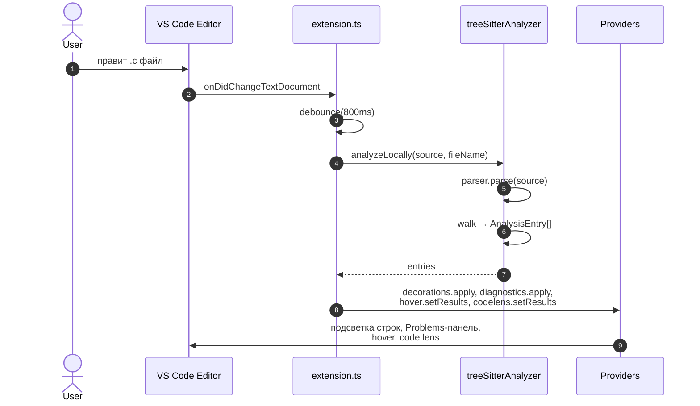
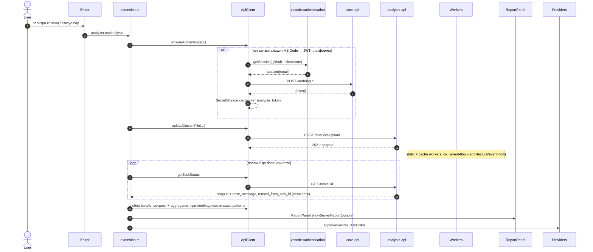
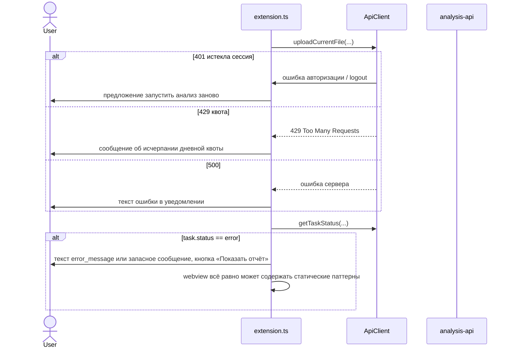
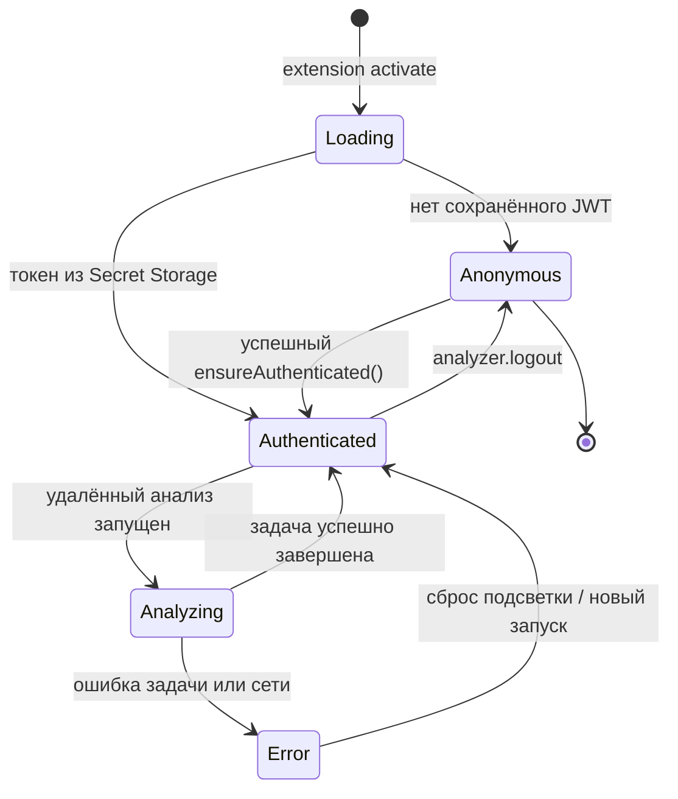
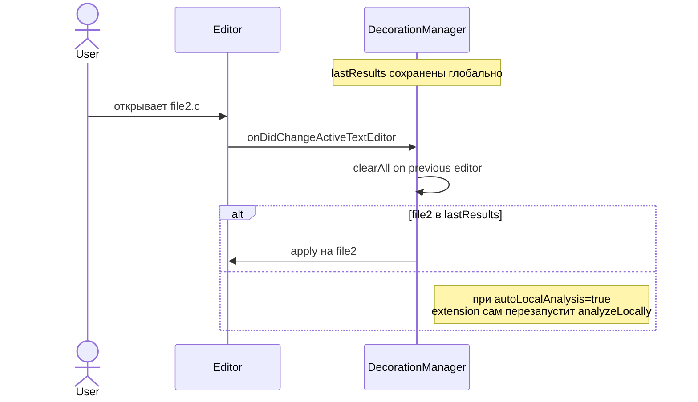

# Sequence: in-editor flow

Эта страница соединяет два сценария — local-analysis и remote-analysis — в одной картине.

## Local analysis (на каждое сохранение)

## Remote analysis (команда «Анализатор: запустить анализ на сервере»)

## Что происходит при ошибках

## Состояние status bar

Текст в статусбаре по реализации:

- после инициализации Tree-sitter: `Анализатор (TS готов)`;
- при входе на платформу: `Анализатор: email@…`;
- до входа — `Анализатор`; прогресс серверного запроса показывает **глобальный progress** VS Code со статусом задачи на русском.

## Жизнь decorations при смене editor

::: tip Почему такой подход
- Декорации не "переживают" между файлами автоматически — VS Code привязывает их к конкретному editor-у.
- Расширение само заново применяет результаты при смене активного editor-а, чтобы пользователь не терял подсветку.
:::
