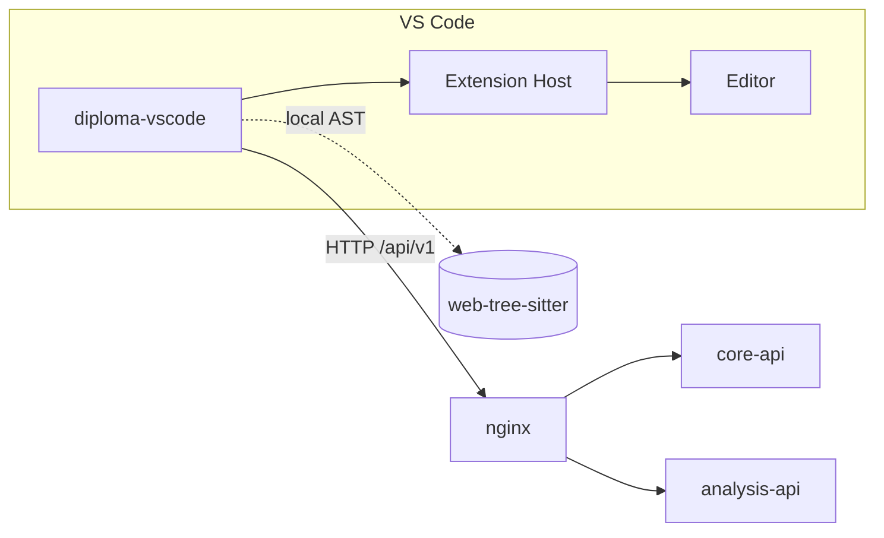
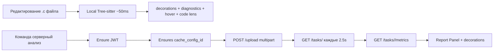

# VS Code Extension — Overview

`diploma-vscode` — расширение для VS Code, дающее **in-editor** UX анализа памяти C-кода (в монорепозитории исходники лежат в каталоге **`vs-code/`**):

- автоаутентификация через VS Code Account (GitHub / Microsoft);
- запуск удалённого анализа через API платформы (с тем же **`cache_config_id`**, что и веб-песочница);
- выбор или загрузка **JSON-конфига симулятора кэша** (`GET` / `POST /analysis/cache-configs`);
- **локальный** быстрый анализ через `web-tree-sitter`;
- подсветка строк, hover-подсказки, code lens, diagnostics с severity;
- панель отчёта с метриками (hit/miss/score).

## Место в системе

## Команды

Подписи в палитре — **русские** (`package.json` → `contributes.commands`).

| Команда (ключ) | Что делает |
|---|---|
| `analyzer.login` | «Анализатор: вход» — email платформы или автовход через VS Code Account |
| `analyzer.logout` | «Анализатор: выход» — токен и сохранённый `cache_config_id` очищаются |
| `analyzer.runAnalysis` | «Анализатор: запустить анализ на сервере» — multipart **`cache_config_id` + файл** (`POST /analysis/upload`), затем polling |
| `analyzer.localAnalysis` | «Анализатор: локальный анализ (Tree-sitter)» — только WASM, без симулятора |
| `analyzer.showReport` | «Анализатор: показать отчёт» |
| `analyzer.clearDecorations` | «Анализатор: сбросить подсветку» |
| `analyzer.selectCacheSimulatorConfig` | «Анализатор: выбрать конфиг симулятора кэша» — quick pick или загрузка `.json` |
| `analyzer.addCacheSimulatorConfig` | «Анализатор: добавить конфиг симулятора (JSON)…» — отправка файла на `POST /analysis/cache-configs` |
| `analyzer.newSampleCacheSimulatorConfig` | «Анализатор: создать пример конфига симулятора» — черновик валидного JSON |
| `analyzer.forgetCacheSimulatorConfig` | «Анализатор: сбросить сохранённый конфиг симулятора» |

## Конфиг симулятора и строка состояния

Удалённый анализ **невозможен без** выбранного конфига на стороне `analysis-api`:

- активный **`cache_config_id`** хранится в `globalState` расширения (`analyzer_cache_config_id`);
- вторая строка статус-бара («симулятор: …» / «не выбран») открывает тот же сценарий выбора, что и команда **`selectCacheSimulatorConfig`**;
- при первом «Запустить анализ на сервере» без сохранённого id показывается предупреждение с переходом в выбор/загрузку JSON — как модальное ограничение во встроенном Sandbox (`CacheConfigGateModal`).

Спецификация HTTP и поля форм см. на странице [Analysis API](/backend/analysis-api/api) (upload и конфиги `cache_simulator_configs`).

## Настройки пользователя

| Настройка | Дефолт (репозиторий) | Назначение |
|---|---|---|
| `analyzer.apiUrl` | `http://localhost:8080/api/v1` | Базовый URL API (**без** суффикса `/analysis` — клиент добавляет его сам). Выставите хост вашего nginx, если порт другой (`infra/.env`). |
| `analyzer.pollingIntervalMs` | `2500` | Интервал polling-а удалённой задачи |
| `analyzer.autoLocalAnalysis` | `true` | Автоматический локальный tree-sitter при правках (**debounce 800 ms**) |
| `analyzer.showInlineHints` | `true` | Показывать hint-строки рядом с паттернами |
| `analyzer.severityThreshold` | `info` | Минимальная серьёзность для подсветки строк |

## Два режима анализа

::: tip Зачем оба режима
- **Локальный** — мгновенный feedback при наборе кода. Здесь tree-sitter находит паттерны, но не считает реальные miss-ы (это статика).
- **Удалённый** — полный пайплайн с cachegrind. Долго (секунды), но даёт реальные числа hit/miss.
:::

## Дальше

- [Стек и конфигурация](/clients/vscode/config) — какой webpack, как пакуется WASM.
- [Архитектура расширения](/clients/vscode/architecture) — `extension.ts`, providers, ui.
- [Tree-sitter (локально)](/clients/vscode/tree-sitter) — главный раздел: как работает локальный анализ.
- [Providers (UX)](/clients/vscode/providers) — Decoration / Diagnostic / Hover / CodeLens.
- [UI / мокапы экрана](/clients/vscode/screens) — как выглядит подсветка и Problems.
- [Sequence: in-editor](/clients/vscode/flow).
