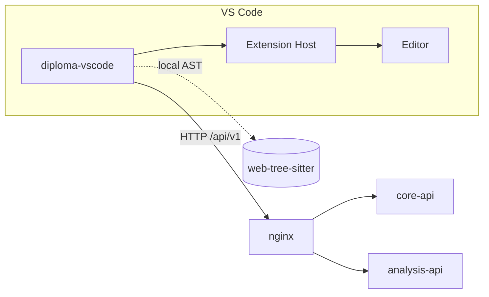
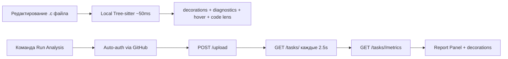

# VS Code Extension — Overview

`diploma-vscode` — расширение для VS Code, дающее **in-editor** UX анализа памяти C-кода:

- автоаутентификация через VS Code Account (GitHub / Microsoft);
- запуск удалённого анализа через API платформы;
- **локальный** быстрый анализ через `web-tree-sitter`;
- подсветка строк, hover-подсказки, code lens, diagnostics с severity;
- панель отчёта с метриками (hit/miss/score).

## Место в системе

## Команды

| Команда | Что делает |
|---|---|
| `Analyzer: Login` | Принудительный auth flow (GitHub) |
| `Analyzer: Logout` | Очищает токен из secrets |
| `Analyzer: Run Analysis` | Загружает текущий .c в backend и поллит результат |
| `Analyzer: Run Local Analysis (Tree-sitter)` | Мгновенный локальный анализ через WASM |
| `Analyzer: Show Report Panel` | Открывает webview-панель с метриками |
| `Analyzer: Clear Decorations` | Стирает подсветку и diagnostics |

## Настройки пользователя

| Настройка | Дефолт | Назначение |
|---|---|---|
| `analyzer.apiUrl` | `http://localhost:80/api/v1` | Базовый URL API |
| `analyzer.pollingIntervalMs` | `2500` | Интервал polling-а удалённой задачи |
| `analyzer.autoLocalAnalysis` | `true` | Автоматический local-анализ при сохранении/правке |
| `analyzer.showInlineHints` | `true` | Показывать hint-строки рядом с паттернами |
| `analyzer.severityThreshold` | `warning` | Минимальная severity для подсветки |

## Два режима анализа

::: tip Зачем оба режима
- **Локальный** — мгновенный feedback при наборе кода. Здесь tree-sitter находит паттерны, но не считает реальные miss-ы (это статика).
- **Удалённый** — полный пайплайн с cachegrind. Долго (секунды), но даёт реальные числа hit/miss.
:::

## Дальше

- [Стек и конфигурация](/clients/vscode/config) — какой webpack, как пакуется WASM.
- [Архитектура расширения](/clients/vscode/architecture) — `extension.ts`, providers, ui.
- [Tree-sitter (локально)](/clients/vscode/tree-sitter) — главный раздел: как работает локальный анализ.
- [Providers (UX)](/clients/vscode/providers) — Decoration / Diagnostic / Hover / CodeLens.
- [UI / мокапы экрана](/clients/vscode/screens) — как выглядит подсветка и Problems.
- [Sequence: in-editor](/clients/vscode/flow).
