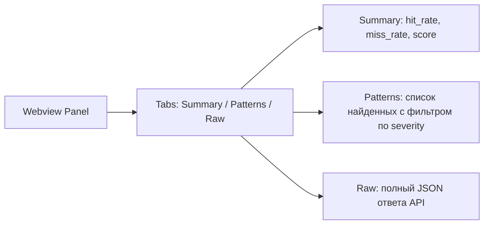
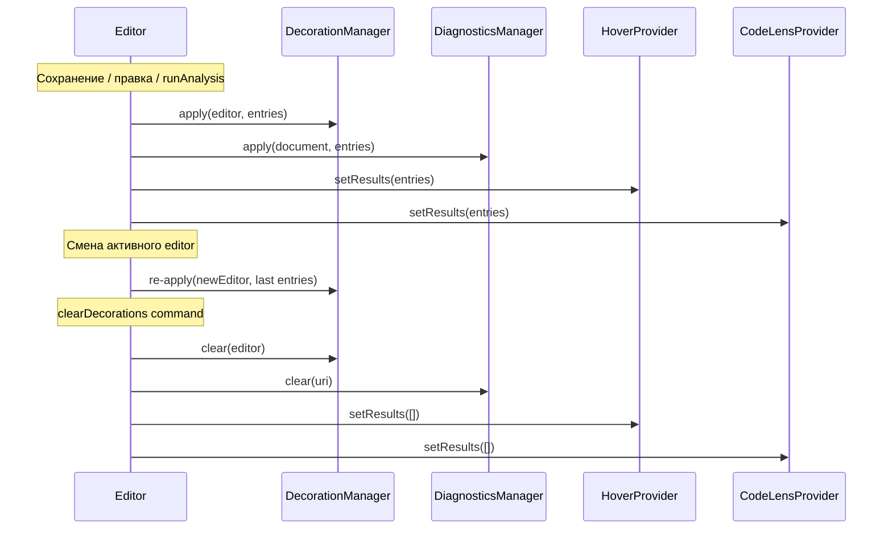

# Providers (UX компоненты)

VS Code предоставляет 4 механизма для отрисовки результатов анализа в редакторе. Все они реализованы как отдельные provider-ы.

## DecorationManager

Цветная подсветка строк с найденными паттернами.

```ts
// src/providers/decorationManager.ts (упрощённо)
const TYPE_COLORS: Record<PatternType, string> = {
  unit_stride:    'rgba(34, 197, 94, 0.18)',  // зелёный
  non_unit_stride:'rgba(234, 179, 8, 0.20)',  // жёлтый
  gather_scatter: 'rgba(249, 115, 22, 0.20)', // оранжевый
  constant:       'rgba(59, 130, 246, 0.18)', // синий
  random:         'rgba(239, 68, 68, 0.20)',  // красный
}

apply(editor, entries) {
  const groupsByType = groupBy(entries, e => e.patternType)
  for (const [type, items] of groupsByType) {
    const decorationType = vscode.window.createTextEditorDecorationType({
      backgroundColor: TYPE_COLORS[type],
      after: showInlineHints
        ? { contentText: `  ${type}`, color: '#888' }
        : undefined,
    })
    const ranges = items.map(e => new vscode.Range(e.line - 1, 0, e.line - 1, 1000))
    editor.setDecorations(decorationType, ranges)
  }
}
```

::: tip Один decorationType на тип паттерна
Если делать decorationType per-line — VS Code захлёбывается на больших файлах. Группировка по типу даёт максимум 5 decorationType-ов независимо от количества строк.
:::

## DiagnosticsManager

Записи в Problems-панели с severity.

```ts
// src/providers/diagnosticsManager.ts
private collection = vscode.languages.createDiagnosticCollection('cache-analyzer')

apply(document: vscode.TextDocument, entries: AnalysisEntry[]) {
  const diags: vscode.Diagnostic[] = entries
    .filter(e => meetsThreshold(e.severity))
    .map(e => {
      const range = new vscode.Range(e.line - 1, 0, e.line - 1, 1000)
      const d = new vscode.Diagnostic(
        range,
        `${e.patternType}: ${e.message}`,
        toVSCodeSeverity(e.severity),
      )
      d.source = 'Анализатор кэша'
      d.code = e.patternType
      return d
    })
  this.collection.set(document.uri, diags)
}
```

::: info Native Problems integration
Использование `DiagnosticCollection` даёт нам бесплатно:

- список в Problems-панели VS Code,
- jump-to-line по двойному клику,
- интеграция с Diagnostic-фильтрами (only errors, only warnings),
- gutter-иконки в редакторе.
:::

## HoverProvider

Tooltip при наведении мыши на строку.

```ts
// src/providers/hoverProvider.ts
provideHover(document, position) {
  const lineEntries = this.results.filter(e => e.line - 1 === position.line)
  if (lineEntries.length === 0) return

  const md = new vscode.MarkdownString()
  md.appendMarkdown(`### Cache analyzer\n\n`)
  for (const e of lineEntries) {
    md.appendMarkdown(`- **${e.patternType}** на \`${e.symbol}\`\n`)
    md.appendMarkdown(`  ${e.message}\n`)
  }
  md.appendMarkdown(`\n[Run remote analysis](command:analyzer.runAnalysis)`)
  md.isTrusted = true       // нужно для command-link
  return new vscode.Hover(md)
}
```

::: tip
- `MarkdownString.isTrusted = true` разрешает встраивать `command:`-ссылки. Без этого VS Code не позволит кликнуть.
- Hover собирает все паттерны на строке — на одной строке может быть и `arr[i]`, и `arr[j]`.
:::

## CodeLensProvider

Inline-ссылка над функцией.

```ts
// src/providers/codeLensProvider.ts
provideCodeLenses(document) {
  const lenses: vscode.CodeLens[] = []
  const byFunction = groupBy(this.results, e => e.function)
  for (const [fn, entries] of byFunction) {
    const firstLine = Math.min(...entries.map(e => e.line)) - 1
    const range = new vscode.Range(firstLine, 0, firstLine, 0)
    const lens = new vscode.CodeLens(range, {
      title: `${entries.length} pattern(s) — ${summarizeTypes(entries)}`,
      command: 'analyzer.showReport',
      arguments: [fn],
    })
    lenses.push(lens)
  }
  return lenses
}
```

::: tip
Каждая функция получает CodeLens с количеством найденных паттернов и кратким summary типов. Клик открывает Report Panel, отфильтрованный на эту функцию.
:::

## ReportPanel (webview)

Полный отчёт с метриками показывается в webview-панели:

```ts
// src/ui/reportPanel.ts (упрощённо)
public static createOrShow(extensionUri, results, metrics) {
  const panel = vscode.window.createWebviewPanel(
    'cacheAnalyzerReport',
    'Cache Analyzer Report',
    vscode.ViewColumn.Beside,
    { enableScripts: true, localResourceRoots: [extensionUri] },
  )
  panel.webview.html = renderHtml(results, metrics)
}
```



::: warning Webview vs native panels
Webview даёт максимальную свободу UI (HTML+CSS+JS), но:

- занимает память отдельной браузерной вкладки;
- не интегрируется с VS Code design system по умолчанию.

Альтернатива — TreeView (нативная боковая панель), которую можно добавить позже для упрощённой навигации.
:::

## Lifecycle providers



## Severity threshold

Настройка `analyzer.severityThreshold` (`info | warning | error`) влияет на:

- DiagnosticsManager — какие записи попадают в Problems.
- DecorationManager — мог бы скрывать info-decorations (сейчас отображаем все).
- CodeLens — показывает суммарное число выше threshold-а.

```ts
function meetsThreshold(severity: Severity): boolean {
  const order = { info: 0, warning: 1, error: 2 }
  return order[severity] >= order[currentThreshold()]
}
```
