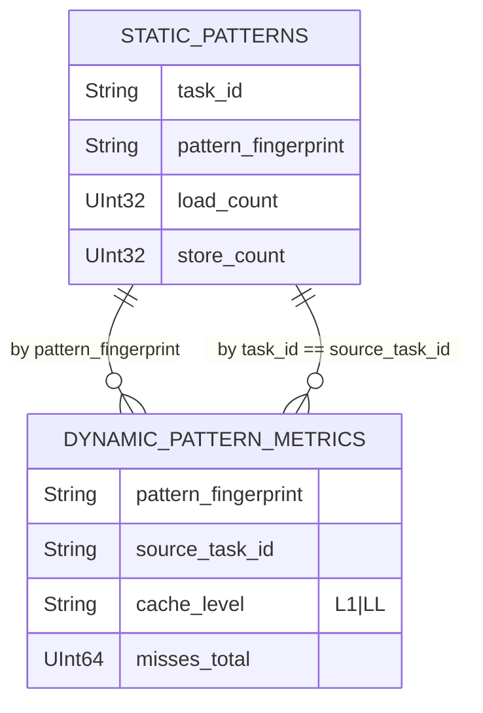

# ClickHouse schema

База данных `analysis_metrics` содержит две таблицы метрик. Полная схема и обоснование DDL-выборов.

## Полная DDL

```sql
CREATE DATABASE IF NOT EXISTS analysis_metrics;

CREATE TABLE IF NOT EXISTS analysis_metrics.static_patterns (
    task_id             String,
    project_id          String,
    source_file         String,
    source_line         UInt32,
    source_column       UInt32,
    function            String,
    base_symbol         String,
    base_kind           String,
    access_kind         String,
    pattern_type        String,
    pattern_fingerprint String,
    affine              UInt8,
    stride              Nullable(Float64),
    depth               UInt8,
    has_indexed_addr    UInt8,
    indexed_by_memory   UInt8,
    conditional         UInt8,
    fill_factor         Float64,
    alignment           Nullable(UInt32),
    working_set_bytes   UInt64,
    dependence          String,
    pattern_signature   String,
    contiguous_block    Nullable(UInt32),
    load_count          UInt32,
    store_count         UInt32,
    cache_profile_hash  String,
    artifact_s3_path    String,
    created_at          DateTime DEFAULT now()
)
ENGINE = MergeTree()
ORDER BY (task_id, source_line, source_column, base_symbol, access_kind);

CREATE TABLE IF NOT EXISTS analysis_metrics.dynamic_pattern_metrics (
    pattern_fingerprint String,
    base_symbol         String,
    access_kind         String,
    cache_profile_hash  String,
    cache_level         String,
    misses_total        UInt64,
    misses_read         UInt64,
    misses_write        UInt64,
    source_task_id      String,
    source_file         String,
    interpreter_version String,
    created_at          DateTime DEFAULT now()
)
ENGINE = MergeTree()
ORDER BY (pattern_fingerprint, base_symbol, access_kind, cache_profile_hash, cache_level, created_at);
```

## Связь между таблицами



::: tip Логические FK без enforced constraint
ClickHouse — OLAP, у него нет foreign keys. Связь поддерживает приложение:

- `pattern_fingerprint` — детерминированный SHA-1 первых 8 байт от ключевых полей паттерна.
- `source_task_id` — равен `task_id` из static-таблицы.

Эти поля используются API при join-агрегациях.
:::

## Почему MergeTree

::: tip
- **OLAP-нагрузка.** Запросы — это всегда `GROUP BY pattern_type`, `SUM(load_count + store_count) WHERE task_id = ?`. MergeTree оптимизирован под full table scans с фильтрами по prefix-у ORDER BY.
- **Compression.** ClickHouse сжимает столбцы лучше, чем row-store (PostgreSQL). На сотнях тысяч паттернов это даёт 10× экономию диска.
- **Partitioning by created_at** не применяется — для текущего объёма данных это лишний overhead. При выходе за миллионы строк добавим `PARTITION BY toYYYYMM(created_at)`.
:::

## Почему такой ORDER BY

### `static_patterns`

```
ORDER BY (task_id, source_line, source_column, base_symbol, access_kind)
```

::: tip
- `task_id` первым — большинство запросов фильтрует "по конкретной задаче". MergeTree эффективно читает только нужные блоки.
- `source_line, source_column` — следующий уровень группировки для UI ("показать паттерны на строке 12").
- `base_symbol, access_kind` — детализация для подсказок типа "сколько load-доступов к массиву A в строке 12".
:::

### `dynamic_pattern_metrics`

```
ORDER BY (pattern_fingerprint, base_symbol, access_kind, cache_profile_hash, cache_level, created_at)
```

::: tip
- `pattern_fingerprint` первым — даёт быстрый lookup "все динамические измерения для этого fingerprint-а" (cross-task analytics).
- `cache_level` (`L1` / `LL`) — селективность для запросов API (он берёт только L1).
- `created_at` в конце — для time-series анализа в admin-аналитике.
:::

## Аналитические запросы

### API: метрики одной задачи

```sql
-- В analysis-api: SUM load + store
SELECT COALESCE(SUM(toUInt64(load_count) + toUInt64(store_count)), 0)
FROM analysis_metrics.static_patterns
WHERE task_id = ?

-- В analysis-api: L1 misses
SELECT COALESCE(SUM(misses_total), 0)
FROM analysis_metrics.dynamic_pattern_metrics
WHERE source_task_id = ? AND cache_level = 'L1'
```

### Admin: топ паттернов

```sql
SELECT pattern_type, COUNT(*) AS count
FROM analysis_metrics.static_patterns
GROUP BY pattern_type
ORDER BY count DESC
LIMIT ?
```

### Admin: лидер по miss-ам (заготовка)

```sql
SELECT
  pattern_fingerprint,
  SUM(misses_total) AS total
FROM analysis_metrics.dynamic_pattern_metrics
WHERE cache_level = 'L1'
GROUP BY pattern_fingerprint
ORDER BY total DESC
LIMIT 20
```

(Сейчас не используется в API, но даёт идею для следующих admin-фич.)

## Pattern fingerprint

```
fingerprint = hex(sha1(pattern_type|base_symbol|base_kind|access_kind|stride|depth|function)[:8])
```

::: info Зачем 16 hex-символов
- 64-bit пространства (2^64) хватает на любые объёмы платформы — коллизий не будет.
- Видно глазами в логах и UI.
- Стабильно: один и тот же `for (i=0; ...; i++) A[i] = ...;` в любой задаче даёт один fingerprint.
:::

## CacheProfileHash

```
L1=32K_8w_64B|L2=256K_8w_64B|L3=8M_16w_64B
```

Описывает иерархию кэша, для которой считались метрики. Сейчас одна, но запись об этом ведётся в каждой строке — чтобы при смене профиля можно было фильтровать `WHERE cache_profile_hash = ?`.

## Дубликаты при retry

::: warning
Если воркер упал между `INSERT` в ClickHouse и `Publish` в Kafka, повторная обработка после рестарта приведёт к **дубликату** строк в CH. Сейчас это допускается:

- API агрегирует через `SUM(...)` `WHERE task_id = ?` — при дубликате суммы вырастут.
- Влияние на пользователя — `total_memory_accesses` будет в 2× больше, чем должен.
- Количество retry-сценариев в реальной эксплуатации — единичное.

**Решение** при выходе в production: `ReplacingMergeTree(created_at)` с уникальным ключом, или `INSERT INTO ... DEDUPLICATE BY ...`.
:::

## Доступ из консоли

```bash
docker exec -it diploma-fix-clickhouse clickhouse-client \
  --user default --password clickhouse_secret -d analysis_metrics

:) SELECT count() FROM static_patterns;
:) SELECT pattern_type, count() FROM static_patterns GROUP BY pattern_type;
:) SELECT * FROM dynamic_pattern_metrics WHERE source_task_id='...' AND cache_level='L1';
```

## Идемпотентная инициализация схемы

Схема создаётся тремя путями (любой из них достаточен):

1. На «чистом» томе ClickHouse выполняет `clickhouse/init.sql` через
   `docker-entrypoint-initdb.d` — стандартный механизм образа.
2. На уже существующем томе срабатывает контейнер `clickhouse-init`, который
   повторно прогоняет `init.sql` (`CREATE DATABASE IF NOT EXISTS`,
   `CREATE TABLE IF NOT EXISTS`).
3. `analysis-api` на старте выполняет `ensureCHSchema` — если init-контейнер не
   отработал, схема создаётся перед первым `INSERT`.

## Размер и retention

Сейчас retention **не настроен** — ClickHouse хранит всё. Объёмы умеренные (десятки байт на строку × тысячи строк на задачу × сотни задач = мегабайты), но при росте платформы рекомендую:

```sql
ALTER TABLE static_patterns
  MODIFY TTL created_at + INTERVAL 90 DAY;
```

Это автоматически удалит данные старше 90 дней при следующих фоновых merge-ах.
