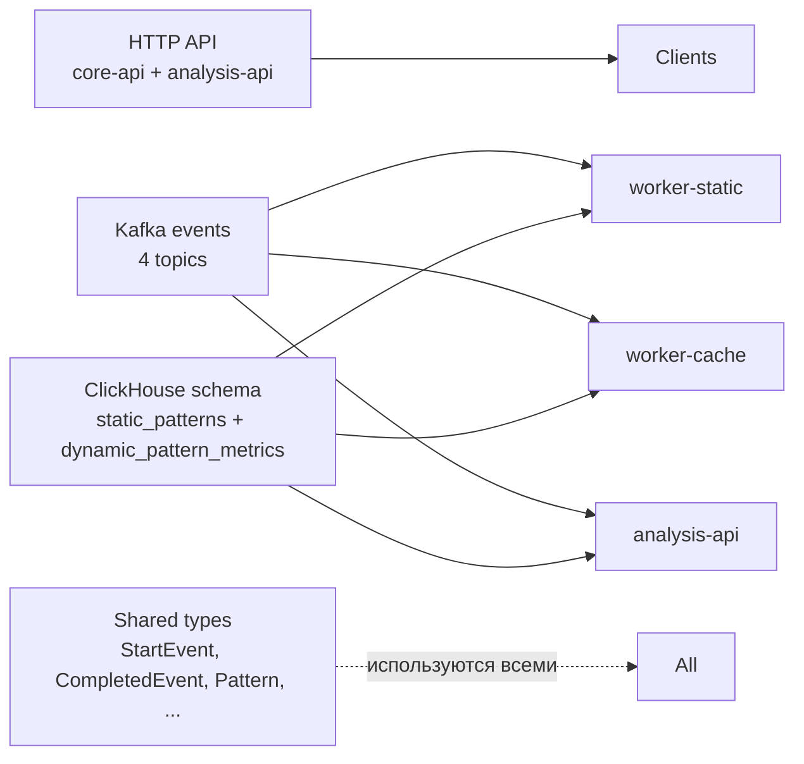

# Контракты

Сводный раздел всех "интерфейсных" описаний платформы — Kafka-события, HTTP-маршруты, ClickHouse-схемы и общие модели данных.

## Виды контрактов

## Что где смотреть

- [Kafka events](./kafka) — payload для всех 4 топиков, переходы FSM, error-варианты.
- [HTTP API Reference](./http) — полный список эндпойнтов обоих API.
- [ClickHouse schema](./clickhouse) — DDL, индексы, ORDER BY, обоснование решений.
- [Общие модели данных](./types) — структуры Go и TypeScript, которые "путешествуют" между сервисами.

## Принципы версионирования

::: tip
- **HTTP API** — версионирование через path-prefix `/api/v1`. Любые ломающие изменения должны идти в `/api/v2`.
- **Kafka events** — топики не имеют версии в имени, но payload может расширяться **только обратно-совместимо** (новые поля → optional). Major-смена → новый топик с `_v2`.
- **ClickHouse** — таблицы расширяются `ALTER TABLE ... ADD COLUMN`. Удаление колонок и переименование — недопустимы без миграции данных.
- **`cache_profile_hash`** — встроенное поле "версионирования параметров cachegrind". При смене профиля кэша новые строки получат другой hash, и можно различать поколения данных в `WHERE`-фильтрах.
- **`interpreter_version`** в `dynamic_pattern_metrics` — версия cache-воркера. Сейчас `cachegrind-1.0`, при переходе на eBPF → `ebpf-2.0`.
:::

## Inter-service compatibility matrix

| Контракт | Producer | Consumer | Текущая версия |
|---|---|---|---|
| HTTP `/api/v1/auth/*` | core-api | frontend, vscode | v1 |
| HTTP `/api/v1/analysis/*` | analysis-api | frontend, vscode | v1 |
| JWT claims | core-api | analysis-api, frontend, vscode | без явной версии |
| Kafka `events.analysis.start_static` | analysis-api | worker-static | без версии |
| Kafka `events.analysis.static_completed` | worker-static | analysis-api | без версии |
| Kafka `events.analysis.start_cache` | analysis-api | worker-cache | без версии |
| Kafka `events.analysis.cache_completed` | worker-cache | analysis-api | без версии |
| ClickHouse `static_patterns` | worker-static | analysis-api | DDL v1 |
| ClickHouse `dynamic_pattern_metrics` | worker-cache | analysis-api | DDL v1 |
| MinIO `static-out.json` | worker-static | worker-cache | без версии |
| MinIO `cache-out.json` | worker-cache | (admin debug) | без версии |
