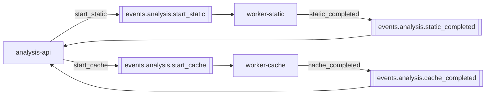
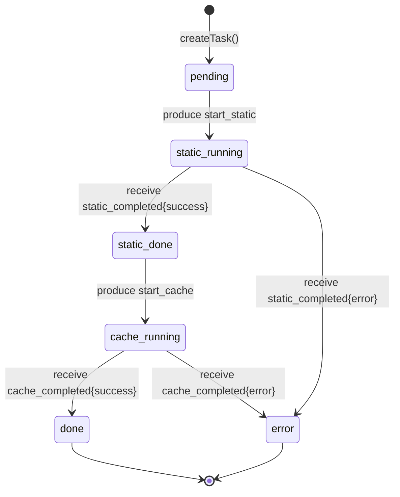

# Kafka events — полная спецификация

Все события передаются в формате **JSON** через Apache Kafka. Ключ сообщения — всегда `task_id` (так все события одной задачи попадают в одну партицию).

## Map of topics



| # | Topic | Producer | Consumer | GroupID consumer-а |
|---|---|---|---|---|
| 1 | `events.analysis.start_static` | analysis-api | worker-static | `worker-static-group` |
| 2 | `events.analysis.static_completed` | worker-static | analysis-api | `analysis-api-events.analysis.static_completed` |
| 3 | `events.analysis.start_cache` | analysis-api | worker-cache | `worker-cache-group` |
| 4 | `events.analysis.cache_completed` | worker-cache | analysis-api | `analysis-api-events.analysis.cache_completed` |

## 1. `events.analysis.start_static`

**Триггер**: пользователь сделал `POST /api/v1/analysis/upload`.

```json
{
  "task_id": "550e8400-e29b-41d4-a716-446655440000",
  "project_id": "11111111-2222-3333-4444-555555555555",
  "file_s3_path": "source-codes/<project_id>/<file_id>.c"
}
```

| Поле | Тип | Обязательное | Назначение |
|---|---|---|---|
| `task_id` | UUID | ✓ | Уникальный ID задачи |
| `project_id` | UUID | ✓ | Нужен воркеру для записи в `static_patterns.project_id` (ClickHouse) |
| `file_s3_path` | string | ✓ | `<bucket>/<key>`. Воркер парсит и качает из MinIO |

::: tip Producer-специфика
- `RequiredAcks: RequireAll` — strong durability при RF>1.
- `Balancer: LeastBytes` — равномерное распределение по партициям.
:::

## 2. `events.analysis.static_completed`

**Триггер**: воркер закончил статический анализ.

::: code-group
```json [success]
{
  "task_id": "550e8400-e29b-41d4-a716-446655440000",
  "status": "success",
  "artifact_s3_path": "analysis-artifacts/<task_id>/static-out.json"
}
```

```json [error]
{
  "task_id": "550e8400-e29b-41d4-a716-446655440000",
  "status": "error",
  "error": "clang failed with no AST output: exit status 1"
}
```
:::

| Поле | Тип | Обязательное | Условия |
|---|---|---|---|
| `task_id` | UUID | ✓ | |
| `status` | enum | ✓ | `success` / `error` |
| `artifact_s3_path` | string | optional | Только при `status=success` |
| `error` | string | optional | Только при `status=error` |

::: warning Воркер всегда публикует ровно одно сообщение
В `processStaticAnalysis` любая ветвь (даже panic-ловящие) приводит к `publishCompleted(success|error)`. Это критическое инвариант — analysis-api гарантированно получит ответ.
:::

## 3. `events.analysis.start_cache`

**Триггер**: analysis-api получил `static_completed` со `status=success`.

```json
{
  "task_id": "550e8400-e29b-41d4-a716-446655440000",
  "project_id": "11111111-2222-3333-4444-555555555555",
  "file_s3_path": "source-codes/<project_id>/<file_id>.c"
}
```

::: tip Тот же payload, что и start_static
Это сделано намеренно — воркер ничего не должен помнить про предыдущий шаг. Cache-воркер сам скачает `static-out.json` по `<task_id>` из MinIO (path-convention).
:::

## 4. `events.analysis.cache_completed`

**Триггер**: cache-воркер закончил.

::: code-group
```json [success]
{
  "task_id": "550e8400-e29b-41d4-a716-446655440000",
  "status": "success",
  "artifact_s3_path": "analysis-artifacts/<task_id>/cache-out.json"
}
```

```json [error]
{
  "task_id": "550e8400-e29b-41d4-a716-446655440000",
  "status": "error",
  "error": "cachegrind failed: ..."
}
```
:::

## State machine задачи через события



| Status в БД | Какое событие переключает | Кто переключает |
|---|---|---|
| `pending` | (создание задачи) | analysis-api `UploadAndAnalyze` |
| `static_running` | publish `start_static` | analysis-api `UploadAndAnalyze` |
| `static_done` | receive `static_completed{success}` | analysis-api `Consumer.handleStaticCompleted` |
| `cache_running` | publish `start_cache` | analysis-api `Consumer.handleStaticCompleted` |
| `done` | receive `cache_completed{success}` | analysis-api `Consumer.handleCacheCompleted` |
| `error` | receive `*_completed{error}` | analysis-api consumer |

## Ключ сообщения и партиционирование

```go
producer.Publish(ctx, topic, /* key */ taskID, payload)
```

::: tip Зачем `key = task_id`
- Все события одной задачи (`start_static`, `static_completed`, `start_cache`, `cache_completed`) имеют один и тот же ключ → попадают в одну партицию.
- Это означает, что **порядок событий гарантирован** в рамках одной задачи. Например, для одного task_id невозможен случай, когда `cache_completed` прочитан раньше `static_completed` (хотя они в разных топиках, в рамках одного топика гарантия порядка соблюдается, и логически они идут последовательно через analysis-api).
:::

## Consumer-настройки

```go
reader := kafkago.NewReader(kafkago.ReaderConfig{
    Brokers: []string{brokers},
    Topic:   topic,
    GroupID: groupID,

    MinBytes:       1,
    MaxBytes:       10e6,
    MaxWait:        time.Second,
    ReadBackoffMin: 200 * time.Millisecond,
    ReadBackoffMax: 5 * time.Second,
    StartOffset:    kafkago.LastOffset, // только в analysis-api consumer-е
})
```

| Параметр | Где |
|---|---|
| `MinBytes/MaxBytes` | Минимальный/максимальный размер batch-а сообщений из брокера |
| `MaxWait: 1s` | Сколько ждать пока соберётся batch |
| `ReadBackoff*` | Экспоненциальный backoff при ошибках чтения |
| `StartOffset: LastOffset` | analysis-api при старте читает только новые — не догребает старые `static_completed` после downtime |

## Расширение событий (forward compatibility)

::: tip
- При добавлении нового поля в `start_static` — оно становится `optional` для воркера. Старый воркер будет игнорить незнакомое поле благодаря `json.Unmarshal` в Go — это безопасно.
- Удаление поля — ломающее изменение → новый топик `events.analysis.start_static_v2`.
- `task_id` всегда остаётся обязательным.
:::

## Как тестировать события

```bash
# Опубликовать руками (для smoke-теста воркера)
docker exec -i diploma-fix-kafka kafka-console-producer \
  --bootstrap-server kafka:29092 \
  --topic events.analysis.start_static <<EOF
{"task_id":"test-1","project_id":"p-1","file_s3_path":"source-codes/p-1/main.c"}
EOF

# Слушать ответ
docker exec -it diploma-fix-kafka kafka-console-consumer \
  --bootstrap-server kafka:29092 \
  --topic events.analysis.static_completed \
  --from-beginning
```
