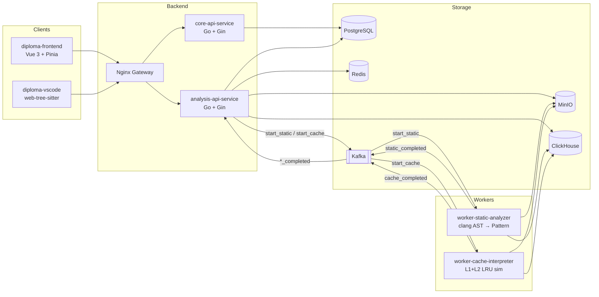

## Что это за платформа

Платформа принимает `.c` файл от пользователя, асинхронно прогоняет его через два независимых воркера и возвращает агрегированную метрику кэш-поведения (hit/miss, optimization score) — как в браузере, так и прямо в редакторе VS Code.

::: info Главные фичи
- **Загрузка `.c` → задача анализа** через `POST /api/v1/analysis/upload`: дедуп по SHA-256, в форме **обязательно** указывается `cache_config_id` (JSON-конфиг из `GET`/`POST /analysis/cache-configs`) — и в веб-Sandbox, и в VS Code-расширении.
- **Список файлов проекта** в Sandbox (`GET /analysis/projects/:project_id/files`): **мягкое удаление** (`DELETE /analysis/files/:file_id`) скрывает файл в UI, данные в MinIO остаются; список задач по проекту фильтруется по видимым файлам.
- **Повторный анализ без повторной загрузки** — `POST /analysis/files/:id/analyze` при неизменном буфере Sandbox/редактора.
- **Статический анализ** воркером `worker-static-analyzer` (бинарник `cmd.exe` под wine).
- **Динамическая симуляция кэша** воркером `worker-cache-interpreter`: внешний бинарь (`INTERPRETER_BINARY`, по умолчанию в коде — `cats`-совместимый путь в Linux-контейнере), результат в MinIO как `cache-out.json`; метрики для UI считает Analysis API из L1 блока этого JSON.
- **Маппинг динамических miss-ов на статические паттерны** по `(source_file, base_symbol, cache_level)`.
- **Светлая/тёмная тема** + русский UI, переключаемые в шапке и сохраняющиеся в `localStorage`.
- **Встроенный быстрый анализ** в VS Code (`web-tree-sitter`) и полный удалённый путь с тем же **`cache_config_id`**, что и в браузере.
:::

## Карта сервисов



## Как читать эту документацию

::: tip Рекомендуемый порядок
1. [Архитектура → Обзор системы](/architecture/) — общая картина.
2. [Архитектура → Event-driven поток](/architecture/event-flow) — как живёт одна задача.
3. [Инфраструктура](/infrastructure/) — компоновка `docker compose`.
4. Внутренняя документация конкретного сервиса (см. левое меню).
5. [Контракты](/contracts/) — справочник по событиям и эндпойнтам.
:::

## Запуск документации

Портал поставляется как Docker-контейнер на `nginx:alpine`.

::: code-group
```bash [платформа и доки отдельно]
# терминал 1 — в каталоге diploma-infra (БД, API, воркеры, gateway)
make up                       # эквивалент docker compose up -d --build
# UI приложения: http://localhost:8080  (NGINX_PORT из .env)

# терминал 2 — в каталоге docs-portal
docker compose up -d docs
# документация: http://localhost:8088
```

```bash [только доки (отдельный compose)]
# в каталоге docs-portal
docker compose up -d docs
# открыть http://localhost:8088
```

```bash [dev hot-reload]
docker compose --profile dev up docs-dev
# открыть http://localhost:5173 — правки .md подхватываются на лету
```

```bash [локально (без Docker)]
npm install
npm run docs:dev
```
:::

::: tip Базовый путь сайта
Dockerfile собирает VitePress с **`VITEPRESS_BASE=/`** (корень), как в `docs-portal/docker-compose.yml` — сайт открывается на порту **8088** без префикса.
:::

::: warning Локальная разработка
Автономный портал на **8088** не проверяет роль пользователя; не путайте с защищёнными эндпойнтами API платформы.
:::
