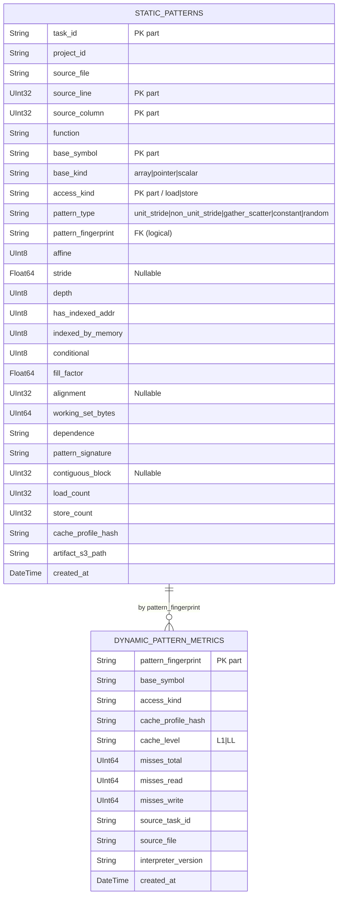

# ClickHouse

ClickHouse 24-alpine хранит OLAP-метрики анализа. БД — `analysis_metrics`, две таблицы:

- `static_patterns` — что нашёл статический анализатор.
- `dynamic_pattern_metrics` — что измерил cachegrind.

## Схема таблиц



## DDL

```sql
CREATE DATABASE IF NOT EXISTS analysis_metrics;

CREATE TABLE IF NOT EXISTS analysis_metrics.static_patterns (
    task_id             String,
    project_id          String,
    source_file         String,
    source_line         UInt32,
    source_column       UInt32,
    function            String,
    base_symbol         String,
    base_kind           String,
    access_kind         String,
    pattern_type        String,
    pattern_fingerprint String,
    affine              UInt8,
    stride              Nullable(Float64),
    depth               UInt8,
    has_indexed_addr    UInt8,
    indexed_by_memory   UInt8,
    conditional         UInt8,
    fill_factor         Float64,
    alignment           Nullable(UInt32),
    working_set_bytes   UInt64,
    dependence          String,
    pattern_signature   String,
    contiguous_block    Nullable(UInt32),
    load_count          UInt32,
    store_count         UInt32,
    cache_profile_hash  String,
    artifact_s3_path    String,
    created_at          DateTime DEFAULT now()
)
ENGINE = MergeTree()
ORDER BY (task_id, source_line, source_column, base_symbol, access_kind);

CREATE TABLE IF NOT EXISTS analysis_metrics.dynamic_pattern_metrics (
    pattern_fingerprint String,
    base_symbol         String,
    access_kind         String,
    cache_profile_hash  String,
    cache_level         String,
    misses_total        UInt64,
    misses_read         UInt64,
    misses_write        UInt64,
    source_task_id      String,
    source_file         String,
    interpreter_version String,
    created_at          DateTime DEFAULT now()
)
ENGINE = MergeTree()
ORDER BY (pattern_fingerprint, base_symbol, access_kind, cache_profile_hash, cache_level, created_at);
```

## Почему MergeTree

::: tip
- **Запросы — это всегда GROUP BY / SUM / COUNT**, никогда single-row lookup. MergeTree оптимизирован именно под это.
- **ORDER BY** в `static_patterns` начинается с `task_id` — все запросы на конкретную задачу читают компактный диапазон partition-ов.
- В `dynamic_pattern_metrics` ORDER BY начинается с `pattern_fingerprint`, чтобы аналитика "сколько miss-ов даёт каждый паттерн" работала по locality.
:::

::: warning Без `ReplacingMergeTree` — допускаются дубли
Если воркер упал между insert-ом в ClickHouse и публикацией Kafka-события, при retry вставка повторится. ClickHouse это не отбросит. Решения:

- **Сейчас**: API агрегирует по `WHERE task_id = $1` — всё равно увидит правильную сумму, если воркер вообще не дописывал результат частично (а это не делает).
- **На будущее**: можно перевести таблицы на `ReplacingMergeTree(created_at)` с уникальным ключом `(task_id, source_line, source_column, base_symbol, access_kind)`.
:::

## Ключевые запросы из API

### Топ паттернов (admin dashboard)

```sql
SELECT pattern_type, COUNT(*) AS count
FROM analysis_metrics.static_patterns
GROUP BY pattern_type
ORDER BY count DESC
LIMIT ?
```

### Метрики одной задачи

```sql
-- Total memory accesses
SELECT COALESCE(SUM(toUInt64(load_count) + toUInt64(store_count)), 0)
FROM analysis_metrics.static_patterns
WHERE task_id = ?

-- L1 misses
SELECT COALESCE(SUM(misses_total), 0)
FROM analysis_metrics.dynamic_pattern_metrics
WHERE source_task_id = ? AND cache_level = 'L1'
```

::: info Hit/miss rate как чистая функция
В `analysis-api/internal/usecase` `GetTaskMetrics` собирает оба значения и считает:

```text
hit_rate          = 1 - (l1_misses / total_accesses)
miss_rate         = l1_misses / total_accesses
optimization_score = hit_rate * 100
```

Если `total_accesses == 0` — возвращаются нули + текущий статус задачи (например, ещё `static_running`).
:::

## Доступ из консоли

```bash
docker exec -it diploma-fix-clickhouse clickhouse-client \
  --user default --password clickhouse_secret -d analysis_metrics

-- внутри:
SELECT count() FROM static_patterns;
SELECT pattern_type, count() FROM static_patterns GROUP BY pattern_type;
```

## CacheProfileHash

В обоих воркерах константа описывает гипотетическую иерархию кэша, для которой считаются метрики:

```
L1=32K_8w_64B|L2=256K_8w_64B|L3=8M_16w_64B
```

Эта строка пишется в каждую запись, чтобы при смене параметров cachegrind можно было различать поколения данных. Сейчас один cache profile, но поле сделано сразу.
