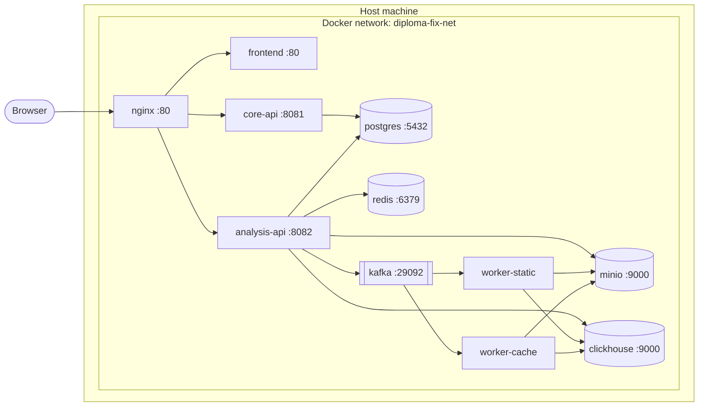
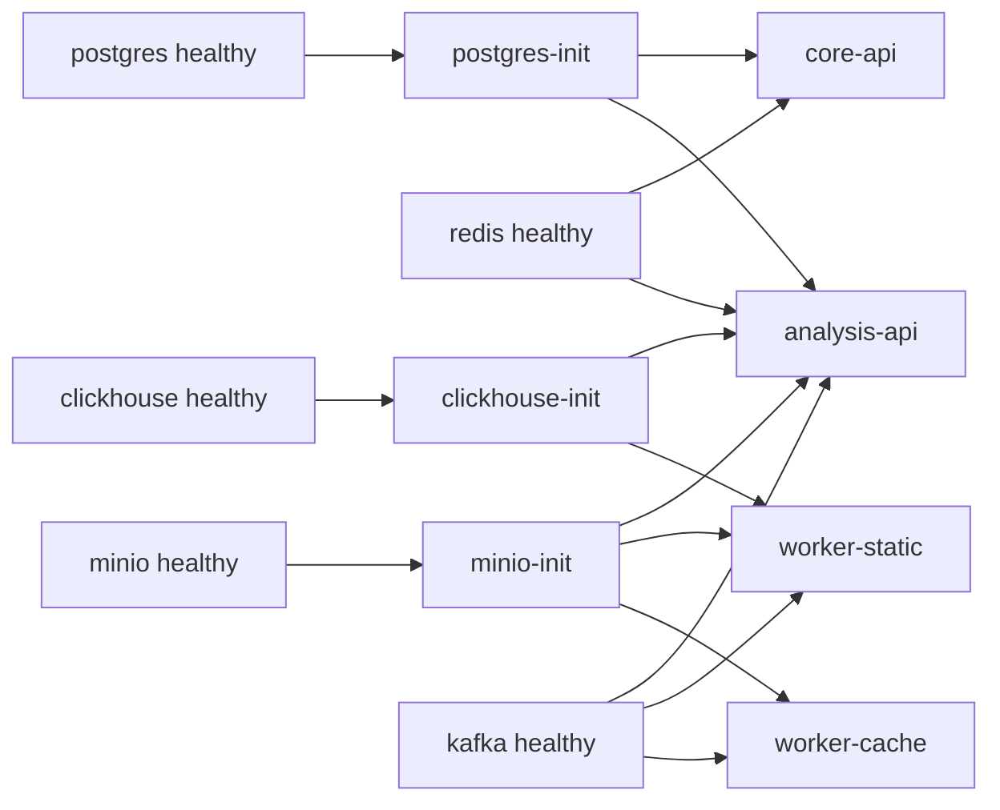

# Инфраструктура

`infra` — модуль, поднимающий всю платформу одной командой `docker compose up -d`. Здесь живут конфиги PostgreSQL, ClickHouse, MinIO, Kafka и nginx-gateway.

## Состав

| Компонент | Образ | Порт (host, defaults) | Назначение |
|---|---|---|---|
| postgres | `postgres:16-alpine` | `15432` | Основная OLTP БД (`core_db`, `analysis_db`) |
| postgres-init | `postgres:16-alpine` | — | Идемпотентный bootstrap: создаёт обе БД при любом старте (даже на старом томе) |
| redis | `redis:7-alpine` | `16379` | Хранилище квот, generic cache |
| minio | `minio/minio:latest` | `19000` (API) / `19001` (console) | S3-совместимое хранилище |
| minio-init | `minio/mc:latest` | — | One-shot создание buckets `source-codes` и `analysis-artifacts` |
| clickhouse | `clickhouse/clickhouse-server:24-alpine` | `18123` (HTTP) / `19100` (native) | OLAP метрики |
| clickhouse-init | `clickhouse/clickhouse-server:24-alpine` | — | Идемпотентный прогон `init.sql` (CREATE IF NOT EXISTS) |
| zookeeper + kafka | `confluentinc/cp-*:7.6.0` | `19092` | Шина событий между API и воркерами. Используются тома `zookeeper_data` и `zookeeper_log` — Zookeeper хранит clusterID в `log`, без него Kafka после рестарта поднимает `InconsistentClusterIdException`. |
| nginx | `nginx:1.25-alpine` | `8080` | Edge gateway, проксирует API + frontend |
| frontend | local build | (внутр.) | Vue 3 SPA |
| core-api | local build | (внутр.) `8081` | Авторизация и CRUD |
| analysis-api | local build | (внутр.) `8082` | Оркестрация анализа |
| worker-static | local build (linux/amd64, ubuntu + winehq) | — | Статический воркер. Запускает `cmd.exe` через `wine`, поэтому контейнер фиксируется в `linux/amd64`. |
| worker-cache | local build (linux/amd64, ubuntu + winehq) | — | Cache simulation воркер. Запускает `CacheSim.exe` через `wine`, контейнер `linux/amd64`. |

::: info Порты задаются через `.env`
Все host-порты вынесены в переменные `*_PORT` в `infra/.env` —
переопределяются перед `make up`. По умолчанию они смещены, чтобы стек мог
сосуществовать с другими docker compose проектами на той же машине.
:::

## Сетевая топология



::: info Внутренний порт Kafka — 29092
Контейнеры внутри `diploma-fix-net` обращаются к Kafka по `kafka:29092` (внутренний listener), а внешний клиент с хоста — по `localhost:${KAFKA_BROKER_PORT}` (по умолчанию `19092`). Это разделение задаётся через `KAFKA_ADVERTISED_LISTENERS=PLAINTEXT://kafka:29092,PLAINTEXT_HOST://localhost:${KAFKA_BROKER_PORT}`.
:::

## Запуск

```bash
# в каталоге infra
cp .env.example .env       # один раз
make up                    # = docker compose up -d --build
```

После старта (порты по умолчанию из `.env.example`):

- UI: `http://localhost:8080`
- Документация: отдельно в `docs-portal` → `http://localhost:8088`
- MinIO console: `http://localhost:19001`
- ClickHouse HTTP: `http://localhost:18123`
- Health gateway: `http://localhost:8080/health`

## Зависимости старта (depends_on)

`docker-compose.yml` использует `condition: service_healthy` чтобы дождаться
готовности БД и брокера. Init-контейнеры (`postgres-init`, `minio-init`,
`clickhouse-init`) запускаются после healthy-родителя, выполняют свою работу
и завершаются (`restart: no`); остальные сервисы ждут их через
`condition: service_completed_successfully`:



::: tip Почему именно healthcheck, а не sleep
`depends_on: condition: service_healthy` гарантирует, что зависимый сервис стартует только после успешного healthcheck-а инфраструктуры. Это убирает целый класс flaky-стартов "DB ещё не приняла соединения".
:::

## Дальнейшие подразделы

- [Docker Compose](/infrastructure/docker-compose) — построчный разбор compose-файла
- [PostgreSQL](/infrastructure/postgres) — две БД и почему они изолированы
- [ClickHouse](/infrastructure/clickhouse) — таблицы метрик и почему MergeTree
- [MinIO](/infrastructure/minio) — buckets и пути
- [Kafka](/infrastructure/kafka) — топики, группы консьюмеров, ack-режим
- [Redis](/infrastructure/redis) — квоты и TTL
- [Nginx Gateway](/infrastructure/nginx) — upstream-ы и маршрутизация
