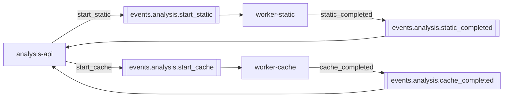

# Kafka

Apache Kafka 7.6.0 (от Confluent) + ZooKeeper. Используется для асинхронной коммуникации между `analysis-api` и воркерами.

## Топики



| Топик | Producer | Consumer | Group ID |
|---|---|---|---|
| `events.analysis.start_static` | analysis-api | worker-static | `worker-static-group` |
| `events.analysis.static_completed` | worker-static | analysis-api | `analysis-api-events.analysis.static_completed` |
| `events.analysis.start_cache` | analysis-api | worker-cache | `worker-cache-group` |
| `events.analysis.cache_completed` | worker-cache | analysis-api | `analysis-api-events.analysis.cache_completed` |

Полные payload-ы — в разделе [Контракты → Kafka](/contracts/kafka).

## Producer (analysis-api)

```go
w := &kafkago.Writer{
    Addr:         kafkago.TCP(brokers),
    Balancer:     &kafkago.LeastBytes{},
    RequiredAcks: kafkago.RequireAll,
}
```

::: tip Почему RequireAll
`RequireAll` означает, что producer ждёт ack от **всех** ISR-реплик. В dev-кластере с RF=1 это эквивалентно "записал на лидера", но при переводе в prod с RF=3 это автоматически даст strong durability — без правок кода.
:::

## Consumer (analysis-api и воркеры)

```go
reader := kafkago.NewReader(kafkago.ReaderConfig{
    Brokers:        []string{brokers},
    Topic:          topic,
    GroupID:        "worker-static-group",
    MinBytes:       1,
    MaxBytes:       10e6,
    MaxWait:        time.Second,
    ReadBackoffMin: 200 * time.Millisecond,
    ReadBackoffMax: 5 * time.Second,
})
```

::: info GroupID = горизонтальное масштабирование
У каждого consumer-а свой `GroupID`. Два инстанса worker-static с одинаковым `worker-static-group` поделят партиции между собой (Kafka rebalances) и **не задублируют обработку**. Это бесплатное масштабирование без изменений в коде.
:::

::: warning У `analysis-api` уникальный GroupID на каждое топика
В коде:

```go
GroupID: "analysis-api-" + topic,
```

Это значит, что **запуск второго инстанса analysis-api сейчас приведёт к нескольким копиям одного события на оба процесса** (т.к. group ID уникальный и для каждого процесса по сути разный). Если потребуется HA для analysis-api — нужно перейти на постоянный shared GroupID (например, `analysis-api-static-completed`).
:::

## Очередь как индикатор нагрузки

`analysis-api` экспонирует длину очереди `start_static` в `/admin/system-status`:

```go
func (uc *AnalysisUseCase) getKafkaQueueSize() (int64, error) {
    conn, _ := kafkago.DialLeader(ctx, "tcp", broker, kafka.TopicStartStatic, 0)
    first, _ := conn.ReadFirstOffset()
    last, _ := conn.ReadLastOffset()
    return last - first, nil
}
```

::: tip Зачем
Это lightweight health-check шины: число "в полёте" сообщений мгновенно показывает, обрабатывает ли воркер очередь или отстаёт. Frontend admin-panel показывает это число.
:::

## Auto-create topics

В `docker-compose.yml`:

```yaml
KAFKA_AUTO_CREATE_TOPICS_ENABLE: "true"
```

При первой публикации Kafka создаёт топик с дефолтами (1 партиция, RF=1). Этого хватает для dev. В prod рекомендую заводить топики явно:

```bash
kafka-topics --bootstrap-server kafka:29092 \
  --create --topic events.analysis.start_static \
  --partitions 4 --replication-factor 3
```

## Команды для отладки

```bash
# Список топиков
docker exec diploma-fix-kafka kafka-topics \
  --bootstrap-server kafka:29092 --list

# Слушать топик в реалтайме
docker exec -it diploma-fix-kafka kafka-console-consumer \
  --bootstrap-server kafka:29092 \
  --topic events.analysis.start_static \
  --from-beginning

# Посмотреть offset-ы группы
docker exec diploma-fix-kafka kafka-consumer-groups \
  --bootstrap-server kafka:29092 \
  --describe --group worker-static-group
```
