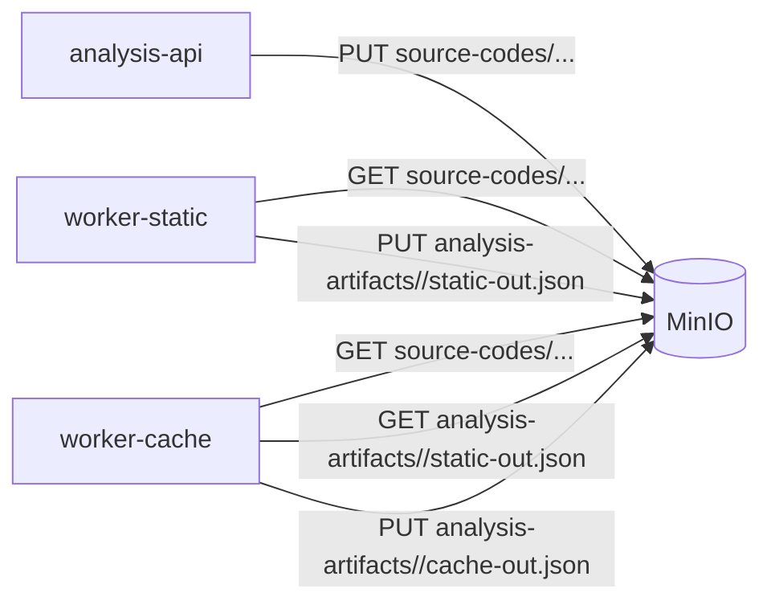

# MinIO (S3-совместимое хранилище)

MinIO используется как объектное хранилище для двух классов данных:

- **`source-codes`** — оригинальные `.c` файлы пользователей.
- **`analysis-artifacts`** — JSON-артефакты воркеров (`static-out.json`, `cache-out.json`).

## Buckets и пути

```
source-codes/
  <project_id>/
    <file_id>.c

analysis-artifacts/
  <task_id>/
    static-out.json    # массив Pattern[] от worker-static
    cache-out.json     # CacheArtifact от worker-cache
```

::: tip Почему ключи именно такие
- `source-codes/<project_id>/<file_id>.c` — `project_id` префикс позволяет в одном `LIST` получить все исходники проекта (для будущей интеграции "история файлов в проекте").
- `analysis-artifacts/<task_id>/...` — все артефакты задачи лежат под одним префиксом, легко удалить разом при cleanup.
:::

## Bootstrap buckets

При первом запуске compose поднимает one-shot контейнер `minio-init` с `mc mb`:

```sh
mc alias set local http://minio:9000 ...
mc mb --ignore-existing local/source-codes
mc mb --ignore-existing local/analysis-artifacts
```

Дополнительно `analysis-api-service/internal/storage/minio.go` тоже умеет создавать buckets:

```go
for _, bucket := range []string{BucketSourceCodes, BucketAnalysisArtifacts} {
    exists, _ := client.BucketExists(ctx, bucket)
    if !exists {
        client.MakeBucket(ctx, bucket, minio.MakeBucketOptions{})
    }
}
```

## Когда какой клиент пишет



## Артефакты

### static-out.json

Массив объектов `Pattern[]` (см. [Worker Static — типы](/workers/static-analyzer/architecture)). Используется cache-воркером для маппинга miss-ов на статические паттерны.

```json
[
  {
    "task_id": "550e84...",
    "project_id": "11111-...",
    "source_file": "main.c",
    "source_line": 12,
    "function": "matmul",
    "base_symbol": "A",
    "base_kind": "array",
    "access_kind": "load",
    "pattern_type": "non_unit_stride",
    "pattern_fingerprint": "8b1c4a7e9f5d2103",
    "load_count": 1024,
    "store_count": 0,
    "stride": 32.0,
    "depth": 2
  }
]
```

### cache-out.json

```json
{
  "task_id": "550e84...",
  "status": "success",
  "summary": {
    "DRefs": 4567890,
    "D1Misses": 12345,
    "LLdMisses": 1234
  },
  "patterns": [
    {
      "pattern_fingerprint": "8b1c4a7e9f5d2103",
      "cache_level": "L1",
      "misses_total": 5000,
      "misses_read": 5000,
      "misses_write": 0
    }
  ]
}
```

## MinIO console

Веб-консоль доступна по `http://localhost:9001`:

- логин/пароль из env (`MINIO_ROOT_USER`, `MINIO_ROOT_PASSWORD`);
- удобно посмотреть/скачать артефакты конкретной задачи прямо из браузера.

## Почему MinIO, а не "загрузка в БД"

::: tip
- `.c` файлы и JSON-артефакты — это **immutable blobs** размером от килобайт до мегабайт. БД не любит большой VARCHAR/BYTEA.
- S3 API стандартен — миграция в "настоящий" AWS S3 для прода — замена endpoint-а и креденшалов.
- MinIO держит свои данные в namespace-ах, легко отделять "сырьё" от "результатов" — критично при cleanup или GDPR-удалении.
:::
