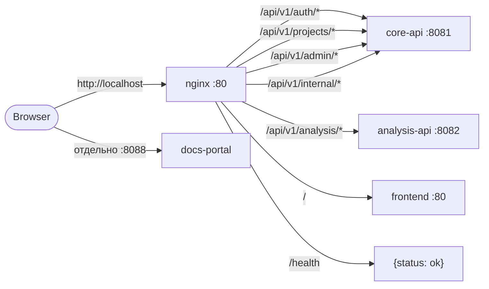

# Nginx Gateway

`nginx:1.25-alpine` — единственная точка входа в систему. Слушает порт 80 и проксирует запросы по path-prefix-у.

## Маршрутизация



## Конфиг

```nginx
upstream core_api      { server core-api:8081; }
upstream analysis_api  { server analysis-api:8082; }
upstream frontend      { server frontend:80; }

location /api/v1/internal { proxy_pass http://core_api; ... }

location / {
    proxy_pass http://frontend;
    ...
}
```

Техническая документация VitePress поднимается **отдельным** compose в `docs-portal` (порт **8088**), не через этот gateway.

## Эндпойнт `GET /api/v1/internal/docs-gate`

В core-api остаётся внутренний обработчик для **nginx `auth_request`** — на случай если снова решите подвесить VitePress за префиксом `/docs/` в одном compose. В текущей схеме **gateway не проксирует доки**; портал открыт на **`http://localhost:8088`** без проверки роли (локальная документация).

При **`login` / `register` / `impersonate`** core-api по-прежнему ставит **HttpOnly** cookie (`AUTH_COOKIE_NAME`, по умолчанию `diplom_access_token`) — это нужно веб‑приложению и любым будущим защищённым маршрутам за nginx.

## Почему так

::: tip Почему path-prefix routing
- **Один origin для UI и API** — браузер не делает CORS-preflight, фронту проще.
- **Скрытие внутренних портов** — `core-api:8081`, `analysis-api:8082` не торчат наружу.
- **Простая миграция** — при появлении нового сервиса добавляется один `location` без изменения клиента.
:::

::: tip Почему именно `/api/v1/analysis`, `/api/v1/admin` отдельно
Хотя обе группы технически живут на разных бэкендах, структура path-ов даёт пользователю ощущение **единого API v1**. Это удобно и для документации (см. [HTTP API Reference](/contracts/http)), и для VS Code-расширения, которое настраивается одной переменной `analyzer.apiUrl`.
:::

## client_max_body_size 50M

`POST /api/v1/analysis/upload` принимает `.c` файл. По умолчанию nginx ограничивает body 1MB — для больших исходников этого мало. 50MB с запасом покрывает учебные программы и не открывает дверь для больших злоупотреблений.

## Заголовки

```nginx
proxy_set_header Host $host;
proxy_set_header X-Real-IP $remote_addr;
proxy_set_header X-Forwarded-For $proxy_add_x_forwarded_for;
proxy_set_header X-Forwarded-Proto $scheme;
```

::: info Зачем X-Forwarded-*
Бэкенд может логировать реального клиента и понимать, что он за TLS-терминатором. Сейчас Gin не использует это для security-логики, но header-ы стоят сразу — чтобы при включении HTTPS в проде ничего не правилось в коде.
:::

## Health endpoint

`GET /health` возвращает локально:

```json
{ "status": "ok" }
```

Это используется в:

- docker-compose healthcheck (можно добавить, сейчас по умолчанию nginx healthy);
- внешнем мониторинге (uptime-checker дёргает `http://localhost/health`).

## Альтернативы и почему не выбраны

::: warning Почему не Traefik / Caddy
- Nginx — самый простой и стабильный edge proxy для статики + reverse proxy.
- Traefik удобен для динамической service discovery (Docker labels), но в нашей системе сервисы фиксированы — преимущество не оправдывает дополнительную сложность.
- Caddy с автоматическим HTTPS не нужен в локальном dev-окружении.
:::
