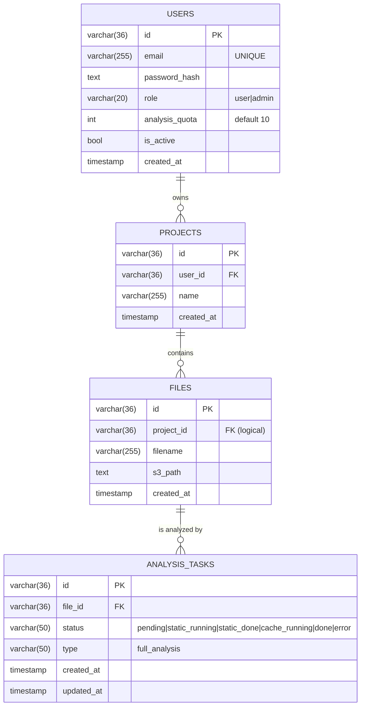

# PostgreSQL

В системе используется один инстанс PostgreSQL 16 с **двумя независимыми БД**:

- `core_db` — для `core-api` (users, projects).
- `analysis_db` — для `analysis-api` (files, analysis_tasks).

## ER-диаграмма



::: warning Cross-database FK
`projects.id` и `files.project_id` живут в разных БД и **не связаны через настоящий FK**. Внутри `core_db` enforce-ится `users.id ↔ projects.user_id`; внутри `analysis_db` — `files.id ↔ analysis_tasks.file_id`. Связь "файл принадлежит проекту" поддерживается на уровне приложения.
:::

## Почему две БД, а не одна

::: tip
- **Изоляция доменов**: core-api ничего не знает про задачи анализа, analysis-api — про учётки. Две БД делают это явно на уровне схемы.
- **Безопасность миграций**: каждый сервис эволюционирует свои таблицы независимо, без риска зацепить чужие.
- **Готовность к раздельному масштабированию**: при необходимости одну из БД легко вынести на отдельный инстанс.
:::

## Миграции

Миграции выполняются прямо в `cmd/api/main.go` через `runMigrations(db)` с использованием `CREATE TABLE IF NOT EXISTS` и `ALTER TABLE ... IF NOT EXISTS`.

```go
schema := `
CREATE TABLE IF NOT EXISTS users (
    id            VARCHAR(36) PRIMARY KEY,
    email         VARCHAR(255) UNIQUE NOT NULL,
    password_hash TEXT NOT NULL,
    role          VARCHAR(20) NOT NULL DEFAULT 'user' CHECK (role IN ('user','admin')),
    analysis_quota INTEGER NOT NULL DEFAULT 10 CHECK (analysis_quota >= 0),
    is_active     BOOLEAN NOT NULL DEFAULT TRUE,
    created_at    TIMESTAMP NOT NULL DEFAULT NOW()
);
ALTER TABLE users
    ADD COLUMN IF NOT EXISTS role VARCHAR(20) NOT NULL DEFAULT 'user';
...
`
```

::: tip Idempotent migrations
`IF NOT EXISTS` + `DROP CONSTRAINT IF EXISTS` + `ADD CONSTRAINT` гарантирует, что повторный запуск не падает, даже если таблицы и колонки уже есть. Это нужно при `docker compose up` поверх существующего volume.
:::

## Default admin

`core-api` при старте создаёт пользователя `admin@system.local` с паролем `admin` и `analysis_quota=1000`, если в БД ещё нет ни одного admin-а:

```go
func ensureDefaultAdmin(db *sqlx.DB) error {
    var count int
    db.GetContext(ctx, &count, `SELECT COUNT(*) FROM users WHERE role = 'admin'`)
    if count > 0 { return nil }
    // ... bcrypt + INSERT ON CONFLICT DO NOTHING
}
```

::: warning Поменять пароль в production
Дефолтный admin удобен для демо, но в production его надо немедленно сменить через `PATCH /admin/users/:id/...` или прямой `UPDATE`.
:::

## Connection pool

Оба сервиса настраивают пул через `sqlx`:

```go
db.SetMaxOpenConns(25)
db.SetMaxIdleConns(5)
```

Плюс retry на старте: 30 попыток × 2 секунды (на случай если postgres ещё инициализируется).

## Доступ к БД

```bash
# core_db
docker exec -it diploma-fix-postgres psql -U diplom -d core_db

# analysis_db
docker exec -it diploma-fix-postgres psql -U diplom -d analysis_db
```

Полезные запросы:

```sql
-- Активные задачи в работе
SELECT id, status, created_at FROM analysis_tasks
WHERE status NOT IN ('done', 'error')
ORDER BY created_at DESC;

-- Топ-пользователей по числу проектов
SELECT u.email, COUNT(p.id) AS projects
FROM users u LEFT JOIN projects p ON p.user_id = u.id
GROUP BY u.email ORDER BY projects DESC LIMIT 10;
```
