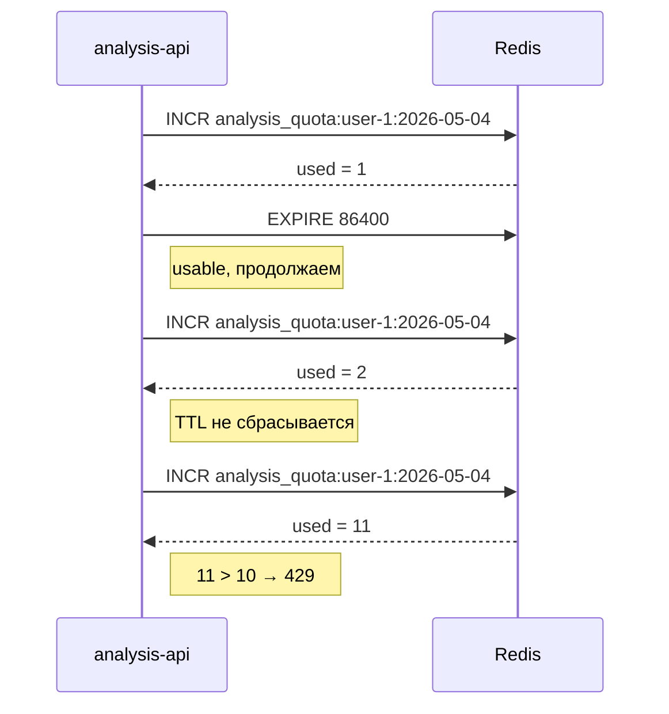

# Redis

Redis 7-alpine используется как:

1. **Quota store** — счётчик дневных анализов на пользователя.
2. **Generic cache slot** — зарезервирован для будущих use-case-ов (rate-limiting, sessions).

## Quota implementation

В `analysis-api-service/internal/usecase/analysis_usecase.go`:

```go
func (uc *AnalysisUseCase) consumeQuota(ctx context.Context, userID string, quota int) error {
    if quota <= 0 {
        return ErrQuotaExceeded
    }

    key := fmt.Sprintf("analysis_quota:%s:%s", userID, time.Now().UTC().Format("2006-01-02"))
    used, err := uc.redis.Incr(ctx, key).Result()
    if err != nil {
        return fmt.Errorf("quota check failed: %w", err)
    }
    if used == 1 {
        _ = uc.redis.Expire(ctx, key, 24*time.Hour).Err()
    }
    if used > int64(quota) {
        return ErrQuotaExceeded
    }
    return nil
}
```

## Почему именно так

::: tip 3 ключевых решения
**1. Ключ привязан к дате (`YYYY-MM-DD`).** Это даёт бесплатный rolling-window: каждый новый день — новый ключ, старые автоматически истекают через TTL.

**2. `INCR` атомарен.** Не нужен Lua-скрипт или `WATCH/MULTI`. Гонка двух одновременных upload-ов разрешается на стороне Redis: оба получат разные значения `used`.

**3. `EXPIRE` ставится только на первом `INCR`.** При повторных `INCR` TTL не сбрасывается — иначе пользователь, который кликает upload каждые несколько часов, никогда не "перевернётся" на следующие сутки.
:::

## Поток квоты



## Источник лимита

`quota` приходит **из JWT** (claim `analysis_quota`), который выдал `core-api`. Если admin поменял лимит через `PATCH /admin/users/:id/quota` — изменение применится только после ре-логина пользователя (новый токен).

::: warning Trade-off
Это значит, что admin не может срезать квоту "налету" — нужно либо invalidate-ить токены (revoke list), либо заставлять пользователя перезайти. Сейчас принят более простой вариант.
:::

## Доступ

```bash
docker exec -it diploma-fix-redis redis-cli -a redis_secret

127.0.0.1:6379> KEYS analysis_quota:*
1) "analysis_quota:abc-uuid:2026-05-04"
127.0.0.1:6379> GET analysis_quota:abc-uuid:2026-05-04
"3"
127.0.0.1:6379> TTL analysis_quota:abc-uuid:2026-05-04
(integer) 78420
```

## Готовность к расширению

Сейчас Redis используется только для квот, но контейнер настраивается через `REDIS_PASSWORD`/`REDIS_ADDR` и подключается уже из обоих API. При появлении новых нужд (sessions, distributed lock, кэш популярных запросов) код-инфраструктура уже на месте.
