# Структура кода — Worker Cache

## Layout

```
worker-cache-interpreter/
├── cmd/
│   └── main.go                      # bootstrap: kafka, minio, interpreter, orchestration
├── internal/
│   ├── interpreter/
│   │   └── interpreter.go           # запуск CacheSim.exe через wine + парсинг текстового stdout
│   ├── config/                      # ENV → Config (kafka, minio, INTERPRETER_BINARY)
│   ├── kafka/                       # Producer + Consumer (events.analysis.*)
│   ├── model/                       # CacheSimResult, CacheLevelSummary, ArrayCacheMetric
│   ├── storage/                     # MinIOClient (DownloadSource + UploadArtifact)
│   └── usecase/                     # CacheUseCase: pipeline одной задачи
├── CacheSim.exe                     # Windows x86_64 PE — внешний симулятор
├── entrypoint.sh                    # прогрев wine prefix перед стартом воркера
└── Dockerfile                       # двух-stage: go-builder + ubuntu:22.04 + winehq + CacheSim.exe
```

## Рантайм-стек

| Слой                  | Где живёт |
|---|---|
| Kafka loop            | `internal/kafka/consumer.go` |
| Бизнес-логика задачи  | `internal/usecase/analysis.go` |
| Запуск симулятора     | `internal/interpreter/interpreter.go` → `wine $INTERPRETER_BINARY <file>.c` |
| Сам симулятор         | `CacheSim.exe` под `wine 11` (winehq-stable) |
| Парсинг               | regexp-набор в `interpreter.go` (см. [Контракт CacheSim](./cachesim)) |
| Сохранение результата | `internal/storage/minio.go` (`cache-out.json`) |

## Пайплайн одной задачи

```mermaid
flowchart LR
    K[Kafka events.analysis.start_cache] --> C[Consumer.Listen]
    C --> UC[CacheUseCase.HandleStartEvent]
    UC --> D[MinIO.DownloadSource → /tmp/cache-interp-*]
    D --> Run[interpreter.Run]
    Run --> Bin["wine CacheSim.exe <file>.c"]
    Bin --> Stdout[Текстовый stdout]
    Stdout --> Parse[parseOutput → CacheSimResult]
    Parse --> JSON[json.Marshal → cache-out.json]
    JSON --> Up[MinIO.UploadArtifact]
    Up --> Pub[Publish events.analysis.cache_completed]
```



## Запуск под `wine`

`internal/interpreter/interpreter.go` дёргает бинарь через `os/exec`:

```go
cmd := exec.Command("wine", i.binaryPath, filepath.Base(sourceFile))
cmd.Dir = filepath.Dir(sourceFile)
cmd.Stdout = &stdout
cmd.Stderr = &stderr
```

Файл передаётся **по имени** (`filepath.Base`), а рабочая директория ставится в `cmd.Dir` — `CacheSim.exe` ищет вход относительно cwd. Stdout захватывается полностью и потом построчно парсится регулярками в `CacheSimResult`.

## Прогрев wine prefix (`entrypoint.sh`)

Wine при первом запуске инициализирует prefix (`services.exe`, `explorer.exe`, …) асинхронно. Если задача попадёт на холодный prefix, `CacheSim.exe` успевает завершиться раньше, чем wineserver полностью готов, и возвращает пустой результат с `Missrate: nan`. Дальше Go-маршалер падает на `unsupported value: NaN`.

Чтобы первая задача была так же надёжна, как любая последующая, контейнер стартует через `entrypoint.sh`:

```sh
wine wineboot --init >/dev/null 2>&1 || true
wineserver -w 2>/dev/null || true

# Холостой прогон над синтетическим .c файлом, чтобы все wine-модули прогрелись.
( cd "$WARMUP_DIR" && wine /usr/local/bin/CacheSim.exe warmup.c >/dev/null 2>&1 ) || true
wineserver -w 2>/dev/null || true

exec /usr/local/bin/worker-cache
```

::: warning CRLF в entrypoint.sh
Скрипт редактируется под macOS/Windows и легко может оказаться с CRLF-окончаниями строк. Тогда shebang `#!/bin/sh\r` ломает запуск (`/bin/sh\r: no such file or directory`). В Dockerfile стоит `RUN sed -i 's/\r$//' /usr/local/bin/entrypoint.sh && chmod +x …` именно для этой защиты.
:::

## Защита от падения

Каждая задача — `os.MkdirTemp("", "cache-interp-*")` + `defer os.RemoveAll`. Любая ошибка (download, exec, parse, upload) превращается в `events.analysis.cache_completed{status:"error", error:"..."}`. Контейнер не падает. Гарантия отправки события: любая ветка в `CacheUseCase.HandleStartEvent` рано или поздно вызывает `sendCompleted`.
