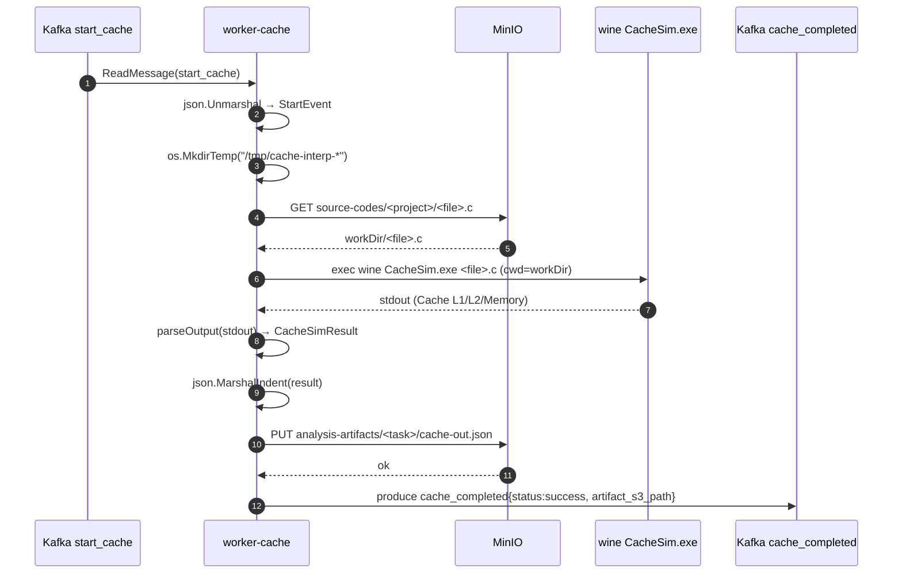
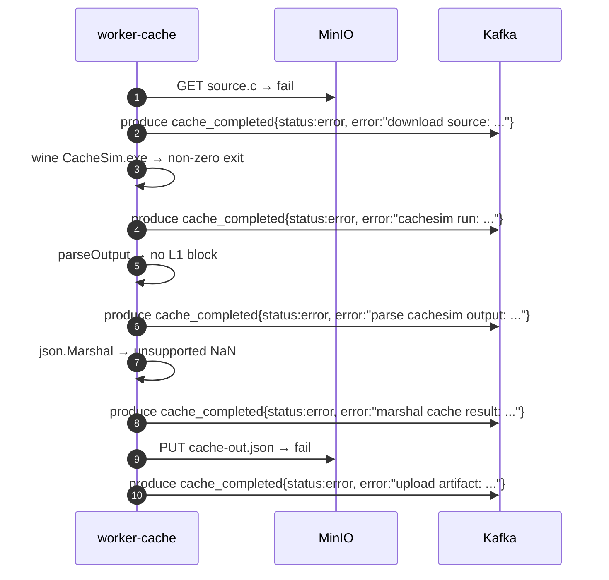

# Sequence — Worker Cache

## Обработка одной задачи (happy path)



После `cache_completed` сценарий продолжается уже на стороне `analysis-api-service` — он скачивает `cache-out.json`, JOIN-ит с `static_patterns` и пишет `dynamic_pattern_metrics`.

## Failure-paths



::: tip Гарантия отправки события
Любая ветка в `CacheUseCase.HandleStartEvent` рано или поздно вызывает `sendCompleted`. Это значит, что для каждой полученной задачи **гарантированно публикуется ровно одно `cache_completed`** — либо `success`, либо `error`.
:::

## Что лежит в `cache-out.json`

```json
{
  "source_file": "main.c",
  "sim_time_sec": 1.44955,
  "l1": {
    "cache_level": "L1",
    "cache_size_kb": 32,
    "cache_line_size": 64,
    "associativity": 8,
    "total_accesses": 4003000,
    "total_hits": 4002812,
    "total_misses": 188,
    "hits_read": 3000000,
    "hits_write": 1002812,
    "misses_read": 0,
    "misses_write": 188,
    "miss_rate": 0.00469648
  },
  "l2": {
    "cache_level": "L2",
    "cache_size_kb": 256,
    "cache_line_size": 64,
    "associativity": 8,
    "total_accesses": 188,
    "total_hits": 0,
    "total_misses": 188,
    "miss_rate": 1
  },
  "arrays": [
    {"cache_level": "L1", "array_name": "a", "misses_total": 62, "misses_read": 0, "misses_write": 62},
    {"cache_level": "L1", "array_name": "b", "misses_total": 63, "misses_read": 0, "misses_write": 63},
    {"cache_level": "L2", "array_name": "a", "misses_total": 62, "misses_read": 0, "misses_write": 62}
  ],
  "memory_reads": 188,
  "memory_writes": 188
}
```

## Тайминги

| Шаг | Время |
|---|---|
| Download .c | <100 ms |
| `wine CacheSim.exe <file>` | от долей секунды до десятков секунд (зависит от итераций цикла) |
| Parse stdout | <10 ms |
| MinIO PUT | <50 ms |
| Kafka publish | <50 ms |

`CacheSim.exe` — основной bottleneck. Под Lima x86_64 VM на Apple Silicon ещё добавляется QEMU-эмуляция, что даёт замедление в несколько раз против нативного x86_64.

## После `cache_completed`

`analysis-api-service` принимает событие через `Consumer.handleCacheCompleted`:

- Если `status == "success"` — скачивает `cache-out.json`, делает JOIN с `static_patterns` по `(source_file, base_symbol == array_name)` и вставляет в `dynamic_pattern_metrics`. Затем переводит задачу в `done`.
- Если `status == "error"` — переводит задачу в `error`, сохраняет `error_message`.

Дальше фронт видит финальный статус и делает `GET /tasks/<id>/metrics`, который агрегирует обе таблицы.
