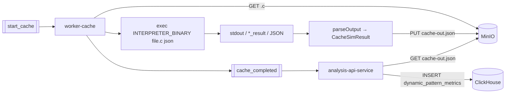

# Worker Cache Interpreter — обзор

`worker-cache-interpreter` (в логах — **`[worker-cache]`**) — второй этап пайплайна. Он скачивает исходник из MinIO, запускает **внешний симулятор кэша**, парсит вывод и сохраняет **`cache-out.json`** в MinIO, затем публикует `events.analysis.cache_completed`.

::: info Как именно запускается симулятор
Путь к бинарю задаётся **`INTERPRETER_BINARY`** (см. `internal/config`). В текущей ветке кода значение по умолчанию — **`/usr/local/bin/cats`**; команда имеет вид:

`<INTERPRETER_BINARY> <basename_файла.c> json` с `cmd.Dir` равным каталогу временного файла.

Исторические страницы про **Wine и `CacheSim.exe`** описывают альтернативный образ развёртывания — убедитесь, что настройки окружения совпадают с вашим Dockerfile/образом.
:::

Запись в ClickHouse делает не воркер, а **`analysis-api-service`**, когда обрабатывает `cache_completed` (JOIN со `static_patterns`, заполнение `dynamic_pattern_metrics`).

## Место в системе



## Что делает воркер

1. Слушает Kafka-топик `events.analysis.start_cache`.
2. Скачивает `.c` во временную директорию.
3. Запускает симулятор согласно `Interpreter.Run` (`internal/interpreter/interpreter.go`).
4. Парсит результат (поддерживаются **JSON** и текстовый вывод **`Cache L1` / `Cache L2` / `Memory reads|writes`**).
5. Сохраняет **`analysis-artifacts/<task_id>/cache-out.json`**.
6. Публикует **`events.analysis.cache_completed`** `{task_id, status, artifact_s3_path, error}`.

## Модель кэша на выходе

В JSON присутствуют сводки по уровням **L1** и **L2** (поля попаданий/промахов, блоки массивов и т.д.). Конкретные размеры и ассоциативность зависят от **выбранного бинаря симулятора**, а не задаются кодом Go-воркера.

## Что является входом и выходом

**Вход** (Kafka payload — тот же `StartEvent`, что у static):

```json
{
  "task_id": "550e84...",
  "project_id": "11111-...",
  "file_s3_path": "source-codes/proj/file.c",
  "cache_profile_hash": "..."
}
```

**Выходы**:

- MinIO — `analysis-artifacts/<task_id>/cache-out.json`.
- Kafka — `events.analysis.cache_completed{task_id, status, artifact_s3_path, error}`.

## Дальше

- [Стек и конфигурация](./config) — env (`INTERPRETER_BINARY`, `INTERPRETER_TIMEOUT_SEC`, …).
- [Структура кода](./architecture) — пайплайн одной задачи.
- [Контракт CacheSim](./cachesim) — формат текстового stdout/ограничения (частично исторический контекст).
- [Sequence](./flow) — happy path и ошибки.
