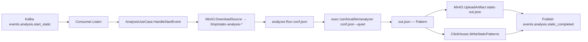

# Структура кода — Worker Static

## Layout

```
worker-static-analyzer/
├── cmd/
│   └── main.go                      # bootstrap: kafka, minio, clickhouse, orchestration
├── internal/
│   ├── analyzer/
│   │   └── analyzer.go              # обёртка: пишет conf.json, вызывает $ANALYZER_BINARY, читает out.json
│   ├── config/                      # ENV → Config (kafka, minio, clickhouse, ANALYZER_BINARY)
│   ├── kafka/                       # Producer + Consumer (events.analysis.*)
│   ├── model/                       # Pattern, StartEvent, CompletedEvent
│   ├── repository/                  # ClickHouseRepo.WriteStaticPatterns
│   ├── storage/                     # MinIOClient (DownloadSource + UploadArtifact)
│   └── usecase/                     # AnalysisUseCase: pipeline одной задачи
└── Dockerfile                       # двух-stage: go-builder → keplar01/static-analyzer:latest
```

Сам бинарь анализатора в репозитории не лежит. Он приходит из публичного базового образа (`/usr/local/bin/analyzer`).

## Рантайм-стек

| Слой                    | Где живёт                                         |
| ----------------------- | ------------------------------------------------- |
| Kafka loop              | `internal/kafka/consumer.go`                      |
| Бизнес-логика задачи    | `internal/usecase/analysis.go`                    |
| Запуск анализатора      | `internal/analyzer/analyzer.go` → `$ANALYZER_BINARY conf.json --quiet` |
| Сам анализатор          | ELF-бинарь `/usr/local/bin/analyzer` из `keplar01/static-analyzer:latest` |
| Запись результатов      | `internal/repository/clickhouse.go` + `internal/storage/minio.go` |

## Пайплайн одной задачи



## Защита от падения

Каждая задача работает в собственной `os.MkdirTemp` директории, очищается через `defer os.RemoveAll`. Если `analyzer.Run` или любая I/O-операция возвращают ошибку, useCase публикует `events.analysis.static_completed{status:"error", error:"..."}` и идёт за следующим сообщением. Воркер не падает из-за одной плохой задачи.

## Почему именно эта схема (Go + внешний бинарь)

- **Go-часть простая и тестируемая**: парсинг конфигов, Kafka, БД, сериализация. Никакого CGO, никакой libclang в линковке.
- **Анализатор — независимый артефакт**, его собрала отдельная команда. Контракт через JSON делает замену прозрачной: можно подменить бинарь на свой, и Go-воркер не надо пересобирать.
- **Фиксация на `linux/amd64`**: бинарь анализатора собран только под эту платформу, поэтому в `compose` сервис закреплён `platform: linux/amd64`, а Stage-1 Go-builder строится с `GOARCH=amd64`. На Apple Silicon это работает через эмуляцию Docker Desktop / OrbStack.
