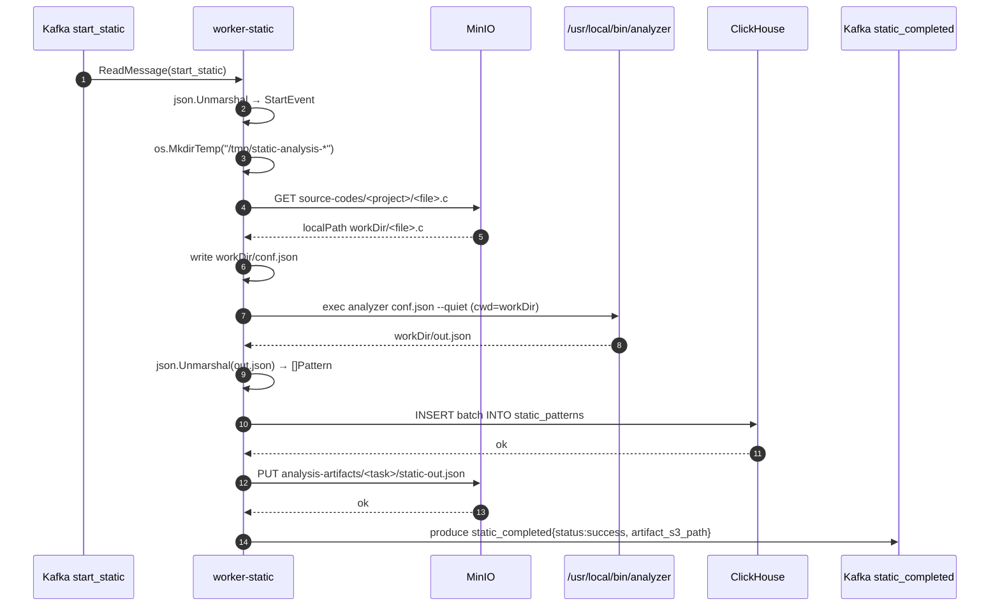
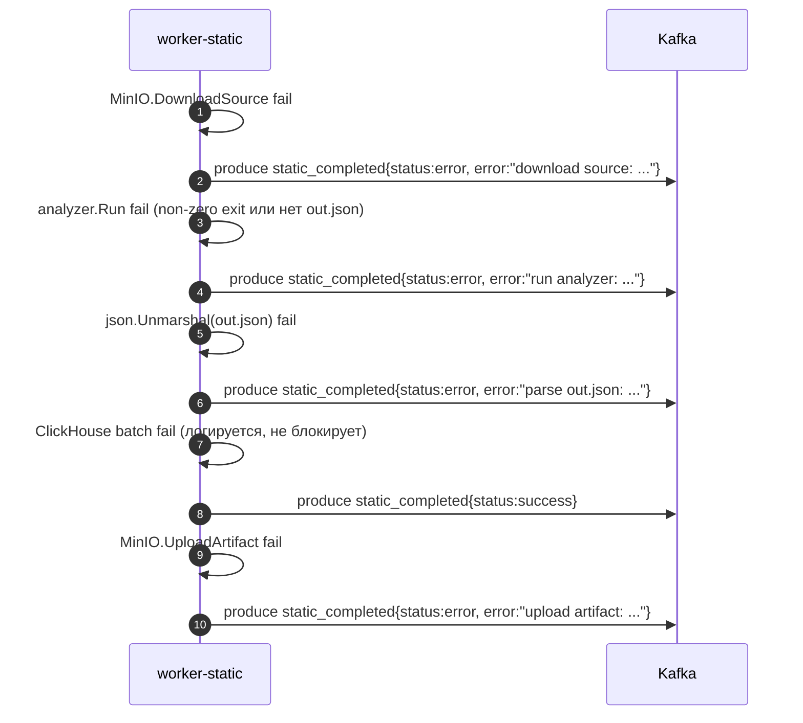

# Sequence — Worker Static

## Обработка одной задачи



## Failure-paths



::: tip Гарантия отправки события
Любая ветка в `AnalysisUseCase.process` рано или поздно вызывает `sendCompleted`. Это значит, что для каждой полученной задачи **гарантированно публикуется ровно одно `static_completed`** — либо `success`, либо `error`.
:::

::: warning ClickHouse не блокирует завершение
Если запись в `static_patterns` упала, воркер только логирует ошибку и всё равно публикует `success`, потому что артефакт `static-out.json` уже лежит в MinIO и доступен фронту. Это сознательный trade-off в пользу частичной доступности результатов.
:::

## Что лежит в артефакте

`static-out.json` — ровно тот массив, который выдал анализатор (формат — на странице [Контракт бинаря](./binary-contract)). Воркер не модифицирует выход.

```json
[
  {
    "access_kind": "load",
    "base_symbol": "A",
    "function": "matmul",
    "pattern_type": "multidim_affine",
    "source_file": "main.c",
    "source_line": 12,
    "stride": 1,
    "depth": 3,
    "fill_factor": 1,
    "...": "..."
  }
]
```
